##  {.cover-slide}

::: cover-logos
 
:::

::: cover-title
Modelización Matemática de la Presión Defensiva en el Fútbol
:::

::: cover-subtitle
Programa de Doctorado en Matemáticas Aplicadas
:::

::: cover-author
César Catalán Capaccioni
:::

::: cover-info
**Directores:**\
José Manuel Calabuig Rodríguez ·\
Luis Miguel García Raffi ·\
Enrique Alfonso Sánchez Pérez
:::

::: cover-affiliation
Departamento de Matemática Aplicada\
Instituto Universitario de Matemática Pura y Aplicada
:::

::: cover-university
Universitat Politècnica de València\
Valencia, 2026
:::

# Estructura Tesis {.con-cabecera}

::: roadmap
-   [1 · Introducción.]{.active}
-   [2 · Uso de Redes Neuronales y Análisis Clúster Jerárquico en el Estudio de los Saques de Puerta en el Fútbol.]{.active}
-   [3 · Modelo Matemático para el Estudio de Métricas Defensivas en el Fútbol: Presiones Individuales, Colectivas y del partido.]{.active}
-   [4 · Marco Dinámico para la Evaluación de la Presión Defensiva en el Fútbol.]{.active}
-   [5 · Firma Defensiva del Jugador: Caracterización de la Agresividad y la Consistencia en la Presión Defensiva.]{.active}
-   [6 . Discusión y conclusiones.]{.active}
:::

# 1. Introducción. {.con-cabecera}

::: roadmap
-   [⚽ 1 · Introducción.]{.active}
-   2 · Uso de Redes Neuronales y Análisis Clúster Jerárquico en el Estudio de los Saques de Puerta en el Fútbol.
-   3 · Modelo Matemático para el Estudio de Métricas Defensivas en el Fútbol: Presiones Individuales, Colectivas y del partido.
-   4 · Marco Dinámico para la Evaluación de la Presión Defensiva en el Fútbol.
-   5 · Firma Defensiva del Jugador: Caracterización de la Agresividad y la Consistencia en la Presión Defensiva.
-   6 . Discusión y conclusiones.
:::

## 1.1 Introducción/La Historia. {.con-cabecera}

::: img-slide
{height="75vh" fig-align="center"}
:::

## 1.1 Introducción/UPV y Levante UD. {.con-cabecera}

::: img-slide
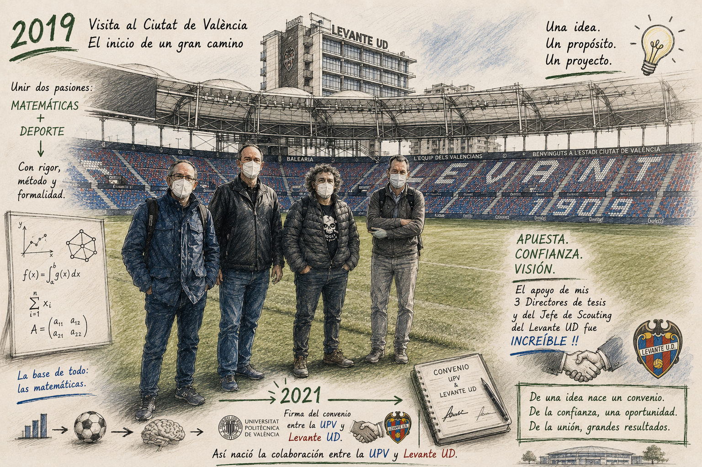{height="75vh" fig-align="center"}
:::

## 1.2 Estado del arte {.con-cabecera}

::: img-slide
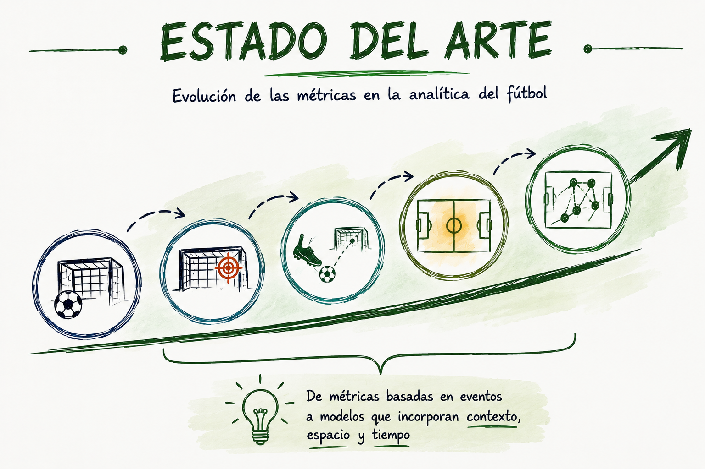{height="75vh" fig-align="center"}
:::

## 1.2 Estado del arte/1 {.con-cabecera}

::::::: columns
:::: {.column width="70%"}
::: data-box
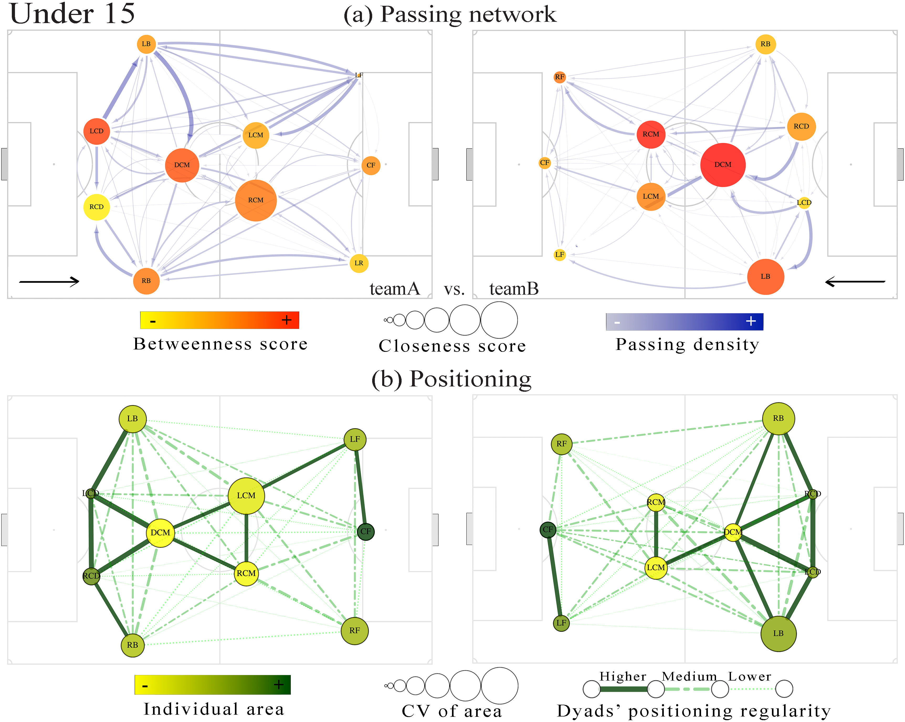{style="display:block; max-height:75vh; width:auto; margin:auto;"}
:::
::::

:::: {.column width="30%"}
::: data-box
**2017**

✓ Team passing networks

✓ Player movement
:::
::::
:::::::

::: footer
[Gonçalves, B., Coutinho, D., Santos, S., Lago-Peñas, C., Jiménez, S. and Sampaio, J. “Exploring team passing networks and player movement dynamics in youth association football”.](https://doi.org/10.1371/journal.pone.0171156){target="_blank"}
:::

::: notes
In summary, this study provided evidence that a lower passing dependency for a given player and higher intra-team well-connected passing relations may optimize team performance. Regarding the correlation between the dyads’ positioning regularity and the passing density.

This study emphasized the potential of coupling notational analyses with spatial-temporal relations to produce a more functional and holistic understanding of teams’ sports performance. The main findings have several implications for the training process design, particularly by helping to identify the major features of youth football teams’ behavioural dynamics.
:::

## 1.2 Estado del arte/2 {.con-cabecera}

::::::: columns
:::: {.column width="70%"}
::: data-box
{style="display:block; max-height:100vh; width:auto; margin:auto;"}
:::
::::

:::: {.column width="30%"}
::: data-box
**2018**

✓ Pitch control

{style="display:block; max-height:100vh; width:auto; margin:auto;"}
:::
::::
:::::::

::: footer
[Spearman, W. “Beyond expected goals”. MIT Sloan Sports Analytics Conference (2018)](https://www.researchgate.net/publication/327139841_Beyond_Expected_Goals){target="_blank"}
:::

::: notes
We define pitch control field (PCF) for location, x, as the probability that the home team will end up with possession of the ball if it were at location, x. The PCF predicts the “next possessor”.

What is Pitch Control?

Get there first with the most men

The PCF will probably depend on the time it takes each player to reach location, x and this time will depend on the location and velocity of each player.
:::

## 1.2 Estado del arte/3 {.con-cabecera}

::::::: columns
:::: {.column width="70%"}
::: data-box
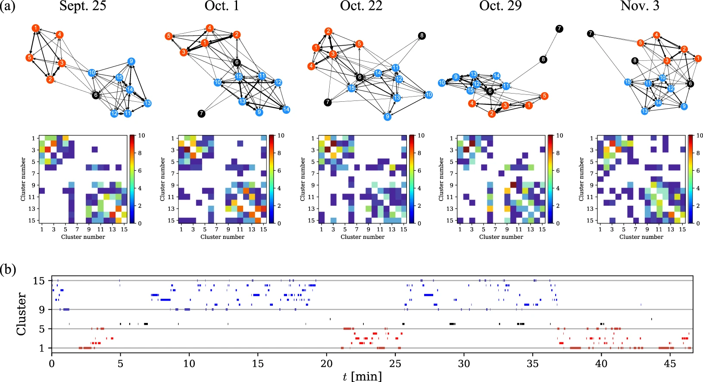{height="100vh" fig-align="center"}
:::
::::

:::: {.column width="30%"}
::: data-box
**2019**

✓ Clustering formation
:::
::::
:::::::

::: footer
[Narizuka, T., Yamazaki, Y. Clustering algorithm for formations in football games. Sci Rep 9, 13172 (2019).](https://doi.org/10.1038/s41598-019-48623-1){target="_blank"}
:::

## 1.2 Estado del arte/4 {.con-cabecera}

::::::: columns
:::: {.column width="70%"}
::: data-box
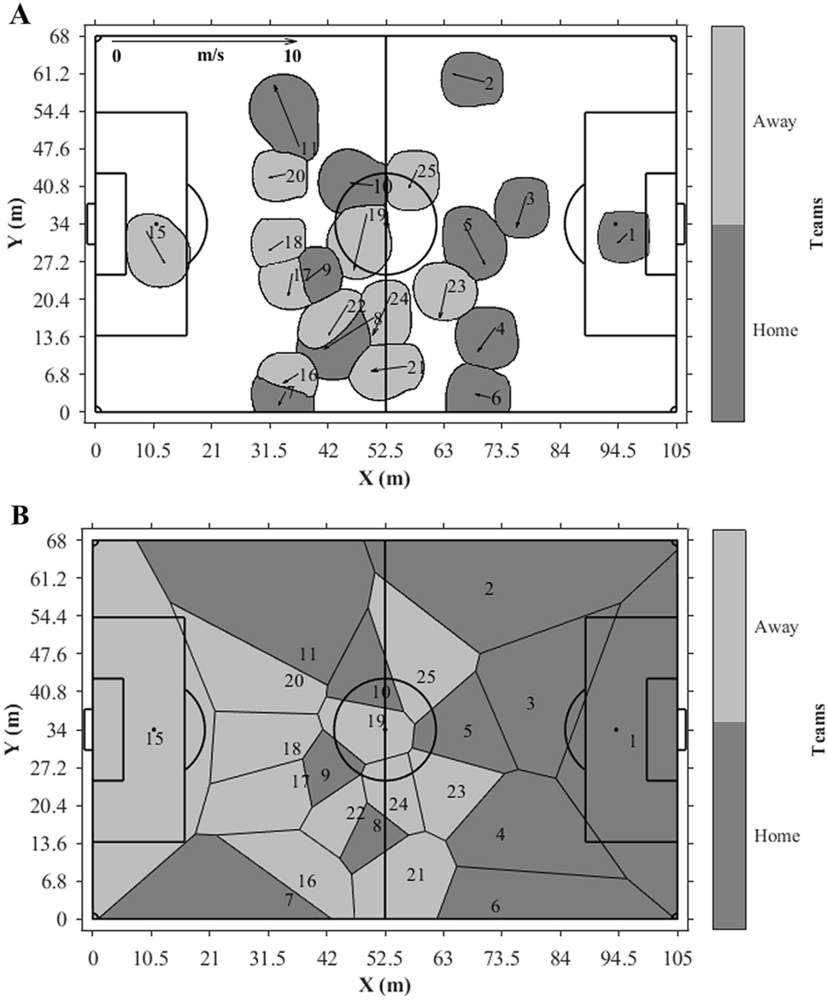{style="display:block; max-height:75vh; width:auto; margin:auto;"}
:::
::::

:::: {.column width="30%"}
::: data-box
**2021**

✓ Dominant regions

✓ Voronoi regions
:::
::::
:::::::

::: footer
[Caetano, F.G., Barbon Junior, S., Torres, R. . et al. Football player dominant region determined by a novel model based on instantaneous kinematics variables. Sci Rep 11, 18209 (2021).](https://doi.org/10.1038/s41598-019-48623-1){target="_blank"}
:::

## 1.2 Estado del arte/5 {.con-cabecera}

::::::: columns
:::: {.column width="70%"}
::: data-box
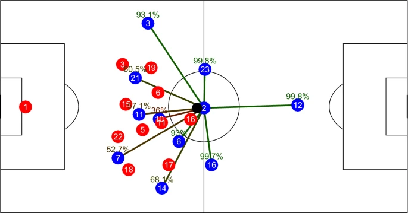{style="display:block; max-height:75vh; width:auto; margin:auto;"}
:::
::::

:::: {.column width="30%"}
::: data-box
**2022**

✓ Espected passes

✓ Xpasses
:::
::::
:::::::

::: footer
[Anzer, G. and Bauer, P. “Expected passes: Determining the difficulty of a pass in football (soccer) using spatio-temporal data”.](https://link.springer.com/article/10.1007/s10618-021-00810-3){target="_blank"}
:::

::: notes
:::

## 1.2 Estado del arte/6 {.con-cabecera}

::::::: columns
:::: {.column width="70%"}
::: data-box
{style="display:block; max-height:75vh; width:auto; margin:auto;"}
:::
::::

:::: {.column width="30%"}
::: data-box
**2024**

✓ Goals scored (G)

✓ Expected Goals on Target (XGOT)

✓ Expected goals (xG)

✓ Possession Value (PV)

✓ Dynamic metrics
:::
::::
:::::::

::: footer
:::

::: notes
¿Cómo se calcula el xG? Cada modelo de xG tiene sus peculiaridades pero estos son los factores que tradicionalmente han formado parte de la gran mayoría de los modelos: Distancia a portería, ángulo respecto a portería, parte del cuerpo con la que se realiza el tiro y tipo de asistencia o acción previa (pase en profundidad, centro, balón parado, regate…). Con esta información sobre un histórico suficientemente grande, el modelo atribuye a cada tiro un valor entre 0 y 1 que expresa la probabilidad de que termine en gol.

Explicar aquí que los xG pueden ser diferentes en función del proveedro de datos que los calcula y lo interesante es buscar métricas defensiva lo suficientemente abstractas y objetivas para que sean identicas para todos
:::

## 1.3 Datos {.con-cabecera}

::: img-slide
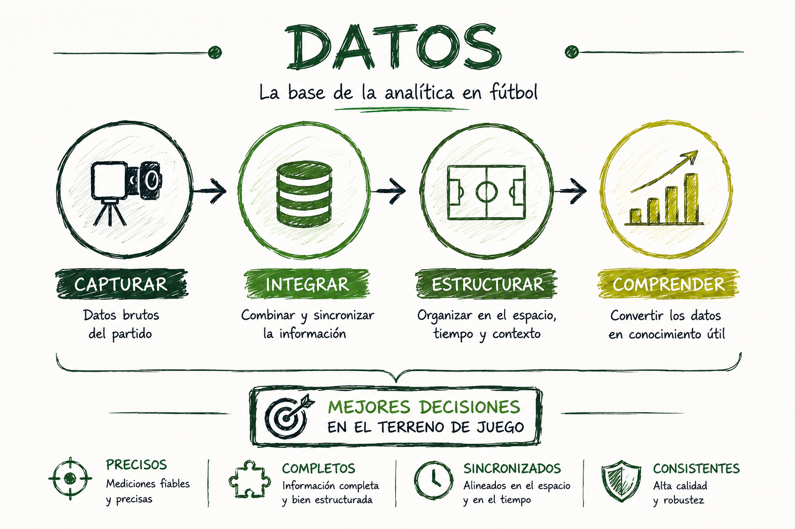{height="75vh" fig-align="center"}
:::

::: footer
:::

## 1.3 Datos/La revolución del dato en el fútbol moderno {.con-cabecera}

```{=html}
<!--  
  APERTURA:    
      1 Revolución del dato
      2 Tecnologías disponibles
      3 Complementariedad tecnológica
      4 Tipos de datos
      5 Comparativa metadata-eventing-tracking
      6 Escala y complejidad
  CIERRE:
      7 necesidad de procesamiento
      8 integración
      9 modelización matemática
-->
```

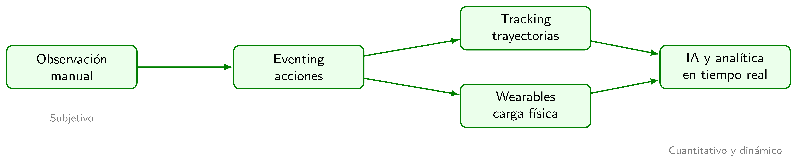{fig-align="center" width="75%"}

::: {.fragment .fade-up style="margin-top:-90px;"}
{fig-align="center" width="75%"}
:::

::: notes
Primero explicar lo que es cada tecnologia por encima: OBSERVACION MANUAL: EVENTING: TRACKING: WEARABLES: IA EN TIEMPO REAL:

Pero también habría que explicar que existen otros datos dedicados al scouting de jugadores, que tratan la información y estadísticas recopiladas referente al: rendimiento, habilidades, caracterísiticas, etc. EL futbol utiliza el PCA- Principal Component Análisis para identificar jugadores similares (verificar). Ver la información de: www.transfermarkt.es www.sofascore.com FBref https://understat.com/ (para medir el xG de varias ligas)

con lo que exista.
:::

## 1.3 Datos/Cómo se obtienen? {.con-cabecera}

::: img-slide
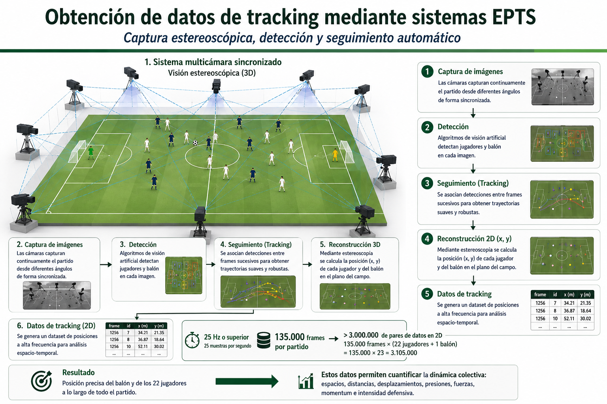{height="75vh" fig-align="center"}
:::

::: notes
Explicar como se obtienen y la cantidad de datos que se hande manipular

EPTS = Electronic Perfomance & Tracking Systems
:::

## 1.3 Datos/Disponibilidad {.con-cabecera .slide-data}

::::::: columns
:::: {.column width="50%"}
::: {.data-box .fragment data-fragment-index="1"}
### Eventing

-   Stats Perform (Opta)
-   StatsBomb
-   Wyscout
-   Hudl
:::
::::

:::: {.column width="50%"}
::: {.data-box .fragment data-fragment-index="1"}
### Tracking

-   Metrica Sports
-   TRACAB
-   Second Spectrum
-   SkillCorner
-   LaLiga Tech
:::
::::
:::::::

::: {.thesis-data .fragment data-fragment-index="3"}
**Datos utilizados en esta tesis**

-   Eventing: StatsPerform Opta F24, Metrica Sports
-   Tracking: Metrica Sports (Sample Game 1 y Sample Game 3)
-   Convenio de investigación con Levante UD
:::

::: notes
Los datos del fútbol. dónde se consiguen? Quien los tiene?, ¿de quien son los derechos? con quien hablar? como tener acceso para la investigación? como se utilizan?

Aquí podemos nombrar: https://www.hudl.com/en_gb/products/statsbomb/platform https://www.statsperform.com/

Se puede comentar que Statbomb tiene su propia libreria de R pero que nosostros no hemos utilizado ninguna! son todas propias y publicadas en esta tesis a través de GITHUB

Sobre el traking comentar que LaLiga tiene un HUB en Madrid donde almacenan todos los datos y comercializan con acuerdos con los diferentes clubs de futbol. Y especialmente hablar de METRICA 3 donde hemos utilizado dos de los partidos expuestos para estudios científicos en XXXXXXX

Comentar el acceso a los datos: - Licencias comerciales - Convenios con clubes - Acuerdos de investigación - Datasets públicos
:::

## 1.3 Datos/Tipologia {.con-cabecera}

::: img-slide
{height="75vh" fig-align="center"}
:::

## 1.3 Datos/Metadatos {.con-cabecera .slide-xml}

``` xml

```

## 1.3 Datos/Metadatos {.con-cabecera .slide-xml}

``` {.xml code-line-numbers="3-4"}

```

## 1.3 Datos/Metadatos {.con-cabecera .slide-xml}

``` {.xml code-line-numbers="3-43"}

```

## 1.3 Datos/Metadatos {.con-cabecera .slide-xml}

``` {.xml code-line-numbers="5-6"}

```

## 1.3 Datos/Metadatos {.con-cabecera .slide-xml}

``` {.xml code-line-numbers="5-27"}

```

## 1.3 Datos/Metadatos {.con-cabecera .slide-xml}

``` {.xml code-line-numbers="7-8"}

```

## 1.3 Datos/Metadatos {.con-cabecera .slide-xml}

``` {.xml code-line-numbers="7-26"}

```

## 1.3 Datos/Metadatos {.con-cabecera .slide-xml}

``` {.xml code-line-numbers="9-10"}

```

## 1.3 Datos/Metadatos {.con-cabecera .slide-xml}

``` {.xml code-line-numbers="9-780"}

```

## 1.3 Datos/Metadatos {.con-cabecera .slide-xml}

``` {.xml code-line-numbers="11-12"}

```

## 1.3 Datos/Metadatos {.con-cabecera .slide-xml}

``` {.xml code-line-numbers="11-30"}

```

## 1.3 Datos/Metadatos {.con-cabecera .slide-xml}

``` {.xml code-line-numbers="13-14"}

```

## 1.3 Datos/Metadatos {.con-cabecera .slide-xml}

``` {.xml code-line-numbers="13-84"}

```

## 1.3 Datos/Metadatos {.con-cabecera .slide-xml}

``` {.xml code-line-numbers="16-17"}

```

## 1.3 Datos/Metadatos {.con-cabecera .slide-xml}

``` {.xml code-line-numbers="16-39"}

```

## 1.3 Datos/Metadatos {.con-cabecera .slide-xml}

``` {.xml code-line-numbers="17-18"}

```

## 1.3 Datos/Metadatos {.con-cabecera .slide-xml}

``` {.xml code-line-numbers="17-113"}

```

::: notes
Los datos del fútbol. Explicar aqui la composición de los archivos de eventing, tracking y metadatos Formatos: JSON, XML, DAT, TXT, Hablar del standar FIFA
:::

## 1.3 Datos/Eventing {.con-cabecera .slide-xml}

``` {.json code-line-numbers="1-6"}

```

## 1.3 Datos/Eventing {.con-cabecera .slide-xml}

``` {.json code-line-numbers="2-3"}

```

## 1.3 Datos/Eventing {.con-cabecera .slide-xml}

``` {.json code-line-numbers="4-36"}

```

## 1.3 Datos/Eventing {.con-cabecera .slide-xml}

``` {.json code-line-numbers="37-69"}

```

## 1.3 Datos/Eventing {.con-cabecera .slide-xml}

``` {.json code-line-numbers="70-103"}

```

## 1.3 Datos/Eventing {.con-cabecera .slide-xml}

``` {.json code-line-numbers="4-6"}

```

## 1.3 Datos/Eventing {.con-cabecera .slide-xml}

``` {.json code-line-numbers="5-249"}

```

## 1.3 Datos/Tracking {.con-cabecera .slide-xml}

``` {.txt code-line-numbers="1|2-7|8-9"}

```

## 1.3 Datos/Calidad y limitaciones del tracking {.con-cabecera}

::::::: tool-list
-   **Precisión espacial limitada.** La localización de jugadores y balón depende de la calibración y resolución del sistema óptico. [Certificación EPTS - FIFA](https://inside.fifa.com/es/innovation/standards/epts/epts-testing-process){target="_blank"}.

::: {.fragment fragment-index="1"}
-   **Oclusiones y pérdidas de seguimiento.** Los jugadores pueden ocultarse mutuamente o quedar temporalmente fuera del campo visual de las cámaras.
:::

::: {.fragment fragment-index="2"}
-   **Errores en la detección del balón.** La elevada velocidad, los rebotes y las ocultaciones dificultan su seguimiento continuo.
:::

::: {.fragment fragment-index="3"}
-   **Interpolaciones automáticas.** Los proveedores pueden reconstruir posiciones ausentes mediante algoritmos de estimación.
:::

::: {.fragment fragment-index="4"}
-   **Posesión del balón.** De forma general, no se dispone del dato de quien tiene la posesión del balón en cada momento del juego (frame).
:::
:::::::

::: notes
Los datos del fútbol. Segun se hayan obtenido y tienen mayor calidad y veracidad. como los depuramos, estructuramos o sincronizamos con los eventos? Enorme trabajo de depuración de errores si los datos son brutos sin revisión previa.
:::

## 1.3 Datos/Tratamiento {.con-cabecera}

::: img-slide
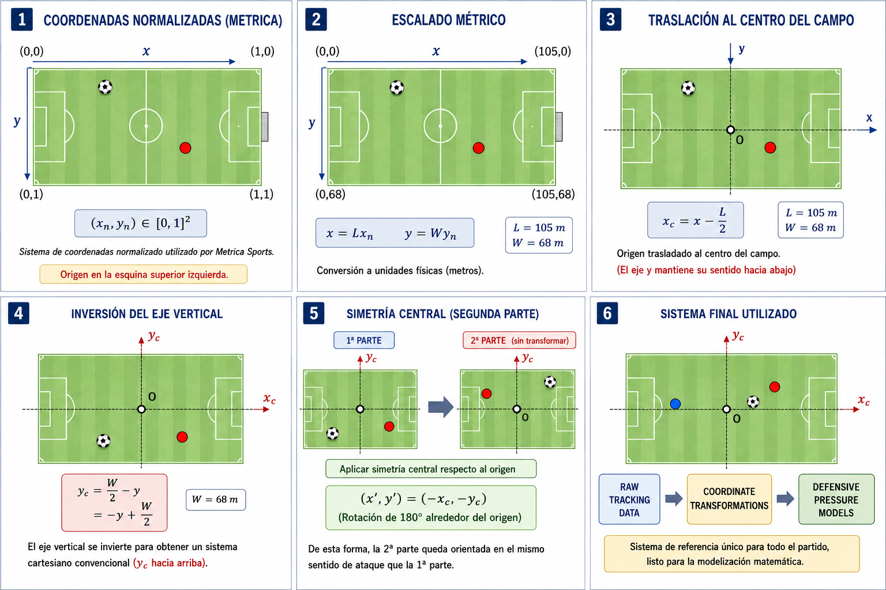{height="75vh" fig-align="center"}
:::

## 1.3 Datos/Inferencia de la posesión {.con-cabecera}

::: img-slide
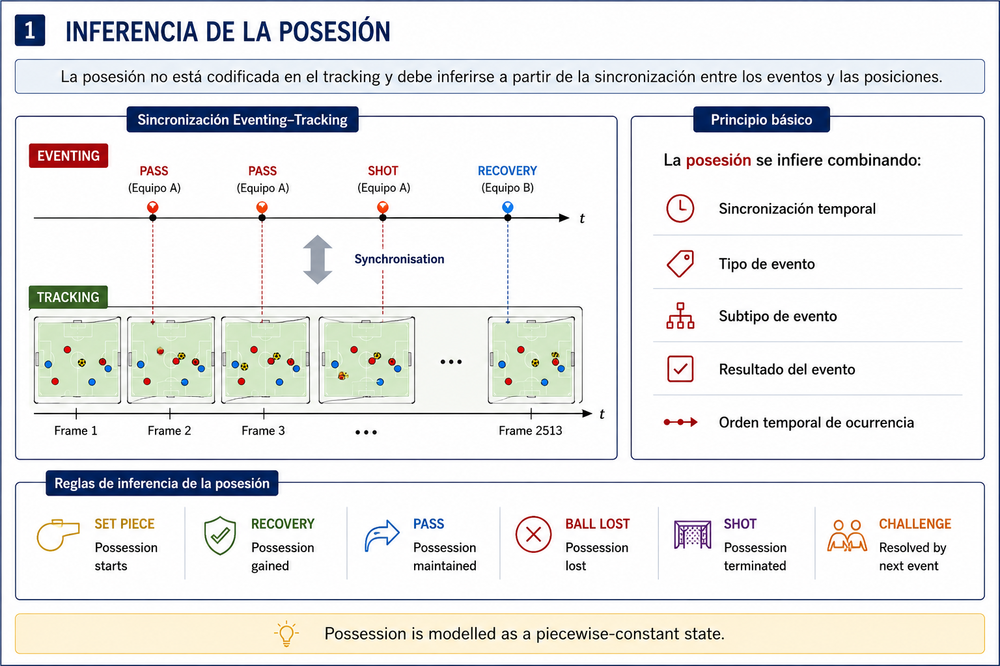{height="75vh" fig-align="center"}
:::

::: notes
Los datos del fútbol. Como los estructuramos manteniendo un criterio o los sincronizamos con los eventos?
:::

## 1.3 Datos/Propagacion temporal de la posesión {.con-cabecera}

::: img-slide
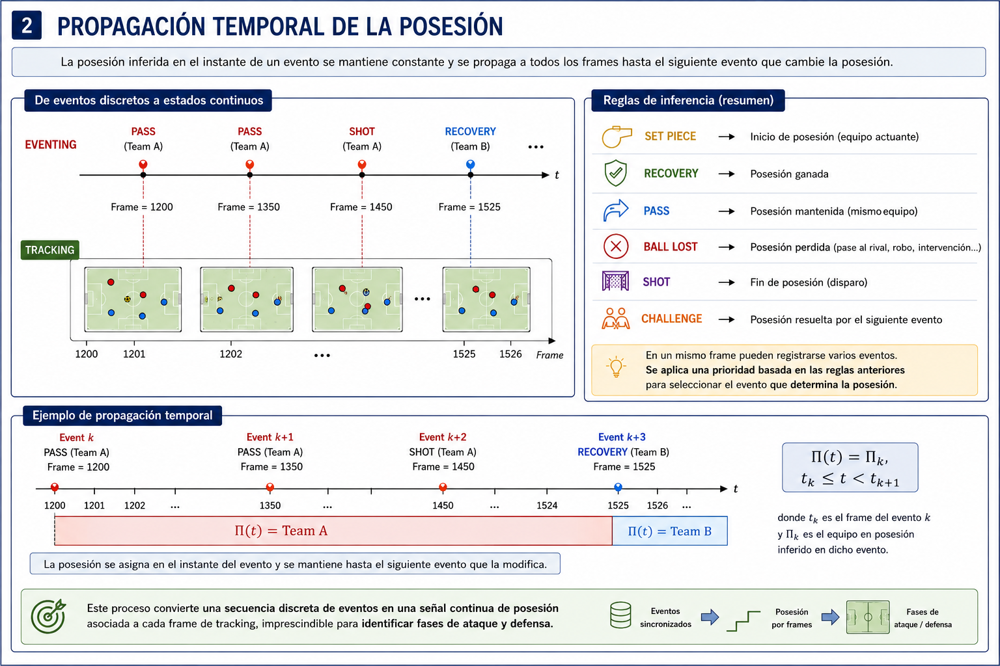{height="75vh" fig-align="center"}
:::

## 1.3 Datos/Estado espacio-temporal del partido {.con-cabecera}

::: img-slide
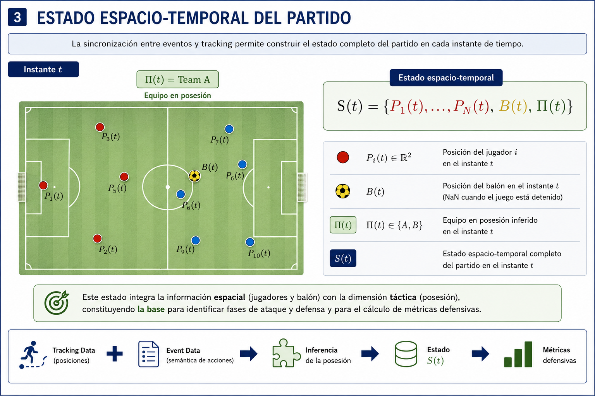{height="75vh" fig-align="center"}
:::

## 1.4 Objetivos {.con-cabecera}

::: img-slide
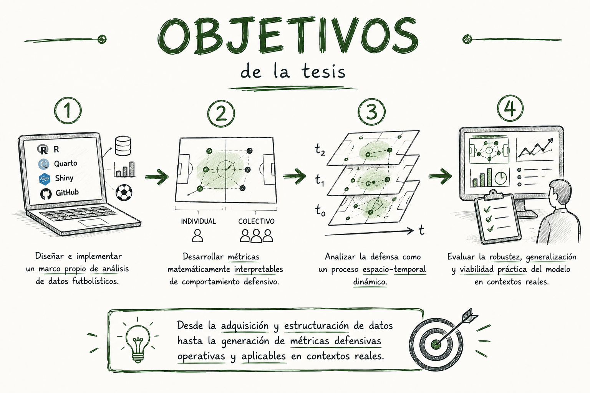{height="75vh" fig-align="center"}
:::

## 1.4 Objetivos {.con-cabecera}

::: box-football
**1. Diseñar e implementar un marco propio de análisis de datos futbolísticos**, basado en herramientas abiertas y scripts desarrollados específicamente para la tesis.
:::

::: box-football
**2. Desarrollar métricas matemáticamente interpretables de comportamiento defensivo**, aplicables desde la acción individual hasta la organización colectiva del equipo.
:::

::: box-football
**3. Analizar la defensa como un proceso espacio-temporal dinámico**, especialmente en situaciones tácticas de pérdida de balón y transición defensa-ataque.
:::

::: box-football
**4. Evaluar la robustez, generalización y viabilidad práctica del modelo**, incluyendo su posible uso en contextos reales, cuasi tiempo real, scouting y apoyo a la toma de decisiones.
:::

::: notes
Notas para explicar los objetivos de la tesis
:::

## 1.5 Herramientas de análisis {.con-cabecera}

::: tool-list
-   **Visualizar y analizar:** Dashboard interactivo para la exploración de métricas y resultados.
-   **Implementar y formar:** Marco computacional reproducible para la construcción de los modelos matemáticos.
-   **Simular y verificar:** Entorno espacio-temporal para el análisis dinámico de las interacciones del juego.
-   **Compartir:** Código fuente abierto para favorecer la transparencia y la reproducibilidad científica.
:::

```{=html}
<!--
-   Dashboard. Cuadro de mandos para analisis de resultados
-   Metodología. Código fuente estructurado para la contrucción y generación del modelo
-   Simulador. Simulador espacio-temporal de encuentro.
-   Codigo fuente abierto a disposición de los investigadores
-->
```

## 1.5 Herramientas de análisis/Visualizar y analizar {.con-cabecera}

[Dashboard](https://ccatalan.shinyapps.io/KPIsFootball){target="_blank"}

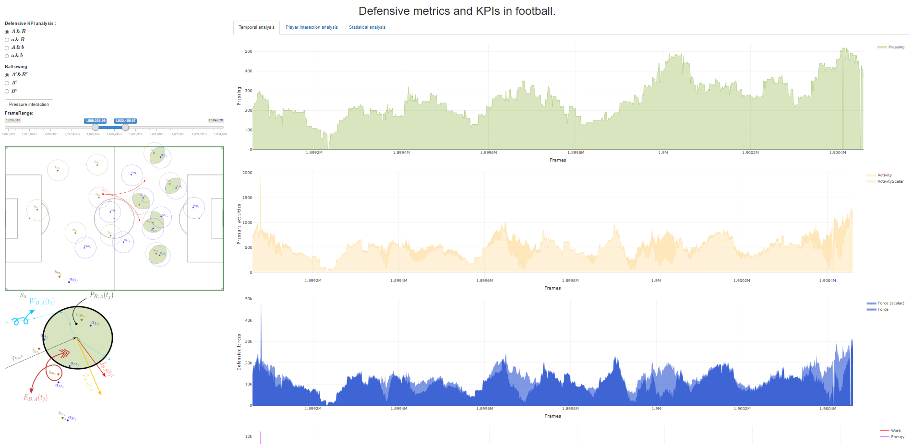{fig-align="center" width="45%"} 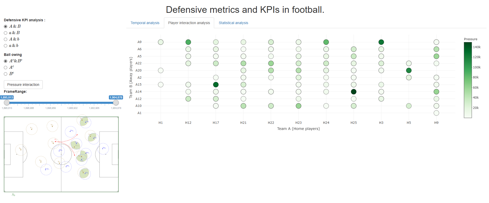{fig-align="center" width="45%"}

## 1.5 Herramientas de análisis/Implementar y formar {.con-cabecera}

[Metodología y análisis del modelo](https://cccapaccioni.github.io/ModellingFootball/Modelling/KPIs.html){target="_blank"}

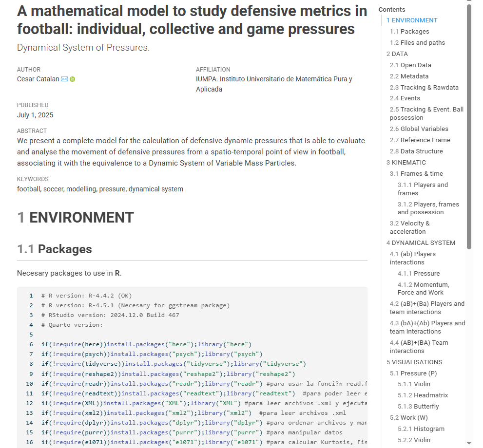{fig-align="center" width="50%"}

## 1.5 Herramientas de análisis/Simular y verificar {.con-cabecera}

<video autoplay loop controls muted playsinline style="display:block; margin:auto; max-width:90%; max-height:75vh;">

<source src="Videos/2136432_Fr1467241-1467241_r1_2.mp4" type="video/mp4">

</video>

## 1.5 Herramientas de análisis/Compartir {.con-cabecera}

[Datos abiertos](https://github.com/cccapaccioni/ModellingFootball){target="_blank"}

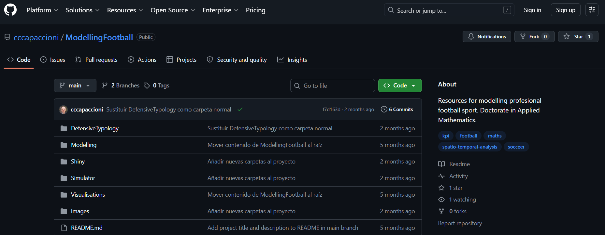{fig-align="center" width="75%"}

# 2 Uso de Redes Neuronales y Análisis Clúster Jerárquico en el Estudio de los Saques de Puerta en el Fútbol. {.con-cabecera}

::: roadmap
-   1 · Introducción
-   [⚽ 2 · Uso de Redes Neuronales y Análisis Clúster Jerárquico en el Estudio de los Saques de Puerta en el Fútbol.]{.active}
-   3 · Modelo Matemático para el Estudio de Métricas Defensivas en el Fútbol: Presiones Individuales, Colectivas y del partido.
-   4 · Marco Dinámico para la Evaluación de la Presión Defensiva en el Fútbol.
-   5 · Firma Defensiva del Jugador: Caracterización de la Agresividad y la Consistencia en la Presión Defensiva.
-   6 . Discusión y conclusiones.
:::

# 2 Uso de Redes Neuronales y Análisis Clúster Jerárquico en el Estudio de los Saques de Puerta en el Fútbol. {.con-cabecera}

::: img-slide
[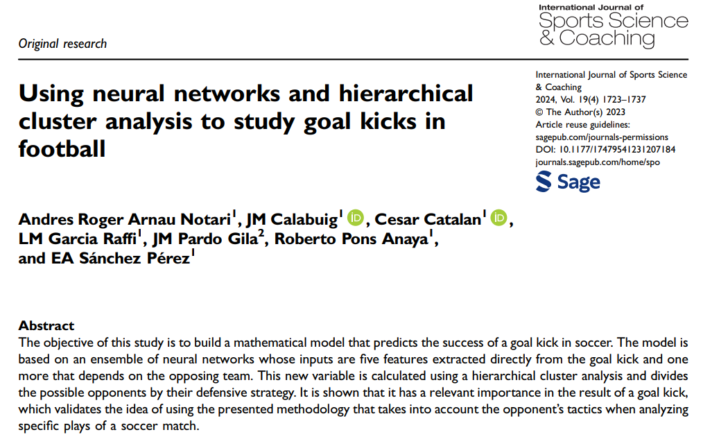{fig-align="center" width="100%"}](https://doi.org/10.1177/17479541231207184)
:::

::: notes
Este artículo viene a responder una cuestión que nos planteó el Levante UD: "Cómo deexitoso puede ser un saque de puerta en corto? El entrenador era Paco López que le gustaba salir con el balón controlado, y el Levante iba muy bien en 2022 y nos dio los datos de eventing de la temporada 2019-20

A Paco López le gustaba salir con la pelota controlada desde la parte baja de la defensa.
:::

## 2.1 Objetivo {.con-cabecera}

:::::::::::::: columns
:::::: {.column width="30%"}
::::: {.box-football .fragment data-fragment-index="1"}
### Problema

⚽ **Saque de puerta**

::: {style="text-align:center; font-size:1em; color:#2e7d32;"}
↓
:::

❓ ¿Cómo de bueno puede ser un saque de puerta en corto?

::: {style="text-align:center; font-size:1em; color:#2e7d32;"}
↓
:::

📊 $\textit{Eventing}$

datos de saques de portería temporada 2020-2021
:::::
::::::

::::::: {.column width="40%"}
:::::: {.box-football .fragment data-fragment-index="2"}
### Metodología

$$f:\mathbb{R}^6 \to \{1,2,3\}$$

6 características de un saque de portería $\to$ (clasificación éxito)

::: {style="text-align:center; font-size:1em; color:#2e7d32;"}
✚
:::

🛡️ **Estrategia defensiva rival**

(Hierarchical Cluster Analysis)

::: {style="text-align:center; font-size:1em; color:#2e7d32;"}
↓
:::

🧠 **Ensemble of Neural Networks**

::: {style="text-align:center; font-size:1em; color:#2e7d32;"}
↓
:::

🎯 **Predicción**

Éxito / Fracaso
::::::
:::::::

:::: {.column width="30%"}
::: {.box-football .fragment data-fragment-index="3"}
### Aportación

✅ Incorporar el comportamiento defensivo del rival

✅ Clasificar rivales según su estrategia defensiva

✅ Mejorar la predicción del resultado del saque de puerta
:::
::::
::::::::::::::

::: notes
El objetivo de este estudio es construir un modelo matemático capaz de predecir el éxito de un saque de puerta en fútbol. El modelo se basa en un conjunto (ensemble) de redes neuronales cuyos datos de entrada son cinco características extraídas directamente del saque de puerta y una característica adicional dependiente del equipo rival.

Esta nueva variable se calcula mediante un análisis clúster jerárquico (Hierarchical Cluster Analysis) y permite clasificar a los posibles oponentes según su estrategia defensiva. Los resultados muestran que dicha variable tiene una influencia relevante en el desenlace de un saque de puerta, lo que valida la metodología propuesta, que incorpora las características tácticas del adversario en el análisis de acciones específicas de un partido de fútbol.

Hipótesis: El resultado de un saque de puerta no depende únicamente de sus características técnicas, sino también de la estrategia defensiva del equipo rival.

Importante, indicar la clasificación de éxito para que tenga sentido el modelo: - Marcar gol no parece lo más efectivo por no haber datos y estadísticas suficientes - Superar la presión rival? - Iniciar la construcción ofensiva
:::

## 2.2 Datos {.con-cabecera}

::: {style="text-align:center; font-size:1em;"}
**282** saques de portería realizados por el Levante UD. Temporada 2020-2021.
:::

::: img-slide
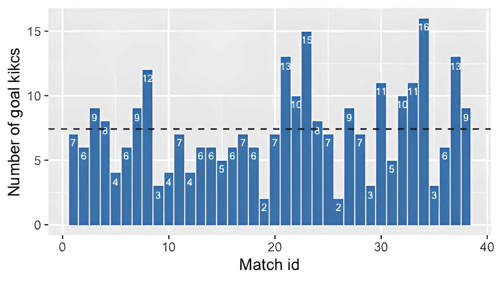{fig-align="center" width="100%"}
:::

## 2.3 Concepto de jugada {.con-cabecera}

::: img-slide
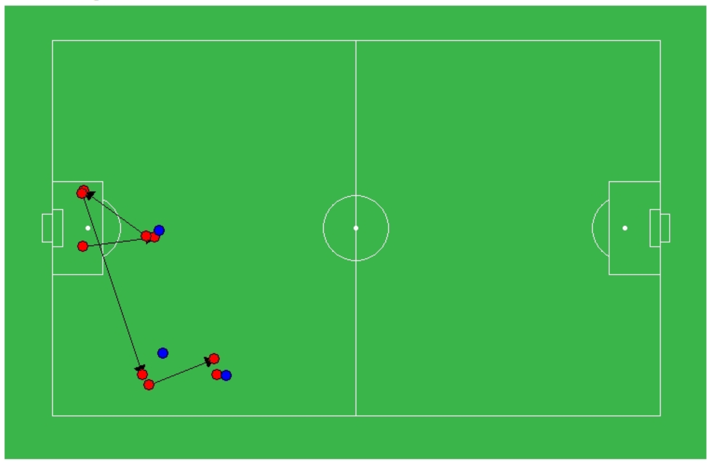{fig-align="center" width="85%"}
:::

::: notes
Explicar aquí los conceptos de clasificación de la jugada
:::

## 2.4 Variables: $\mathbb{R}^6$/Variable $1$ {.con-cabecera}

### Variable $1$

Zona del campo donde termina la jugada

::: img-slide
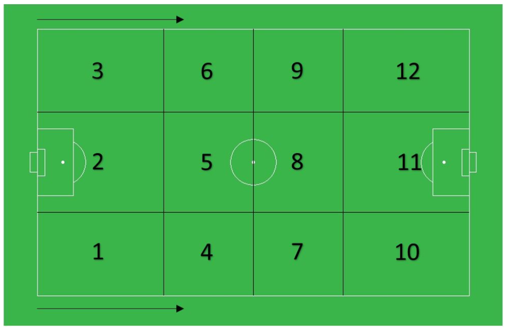{fig-align="center" width="75%"}
:::

::: notes
Lo que no tiene sentido es considerar donde está el balón porque sino el problema se acaba con un patadón del portero hacia adelante. El Levante quería sacar con el balón controlado desde atrás.
:::

## 2.4 Variables: $\mathbb{R}^6$/Variable $2-5$ {.con-cabecera}

### Variables $2-5$

2.  **duración:** segundos entre el último y primer evento de la jugada

3.  **último jugador:** posición en el campo del jugador (del Levante UD) que toca el balón

4.  **primer jugador:** posición del primer jugador (del equipo contrario) que toca el balón tras la pérdida del Levante UD

5.  **tiempo:** entre el último evento tras la pérdida y el siguiente.

::: notes
Señalar que estas variables se sacan automáticamente desde el eventing con cierta facilidad..
:::

## 2.4 Variables: $\mathbb{R}^6$/Variable $6$ {.con-cabecera}

### Variable $6$

6.  **tipo de rival:** [❓]{style="font-size:1.5em;"}

:::: {.data-box .fragment .fade-up}
Variables distintas a considerar para clasificar a los rivales en varios grupos

::: tool-list
[6.a. Recuperaciones (R)]{style="font-size:125%;"}

[6.b. Presión (P)]{style="font-size:125%;"}

[6.c. Faltas cometidas (F)]{style="font-size:125%;"}
:::
::::

::: notes
Estas variables intentan cuantificar el tipo de rival contra el que se juega
:::

## 2.4 Variables: $\mathbb{R}^6$/Variable $6$ {.con-cabecera}

### Variable $6$

6.  **tipo de rival:** [❓]{style="font-size:1.5em;"}

::: data-box
Agrupamiento jerárquico (Hierarchical Cluster Analysis)

Algoritmo de análisis **NO** supervisado
:::

::: notes
Aquí hay que indicar qué tipo de distancia se utiliza (la que separa los puntos) y el método de enlace (la distancia que separa los clusters).

Buscamos un agrupamiento de los datos (equipos) de forma que la distancia entre los grupos sean grande mientras que la distancia entre los miembros de un mismo grupo sea pequela.

Se utiliza la distancia canberra como medida de similitud entre puntos individuales, mientras que el método de enlace Ward es útil en situaciones en la que los datos tienen variaciones en escalas y permite formar grupos más compactos y homogéneos.
:::

## 2.4 Variables: $\mathbb{R}^6$/Variable $6$ {.con-cabecera}

:::::::: columns
:::: {.column width="60%"}
::: data-box
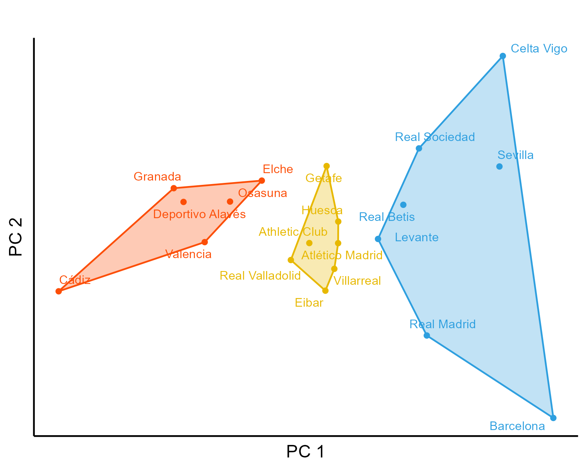{style="display:block; max-height:75vh; width:auto; margin:auto;"}
:::
::::

::::: {.column width="40%"}
::: {.data-box .fragment .fade-up}
Distancia Canberra (individuos): $d_C\left(x_1, x_2\right) = \sum_{j=1}^p \frac{\left|x_{1 j}-x_{2 j}\right|}{\left|x_{1 j}\right|+\left|x_{2 j}\right|}$

Método Ward (grupos): minimización varianza
:::

::: {.data-box .fragment .fade-up}
Normalización de los datos: $\text{(R,P,F)/h} = \frac{\text{(R,P,F)} }{ 1 - \text{P}_{\text M} } \cdot \frac{ 60 }{ 90 \cdot 38 }$
:::
:::::
::::::::

## 2.4 Variables: $\mathbb{R}^6$/Función objetivo {.con-cabecera}

$$f:\mathbb{R}^6 \to \{1,2,3\}$$

::::::: columns
:::: {.column width="40%"}
::: data-box
La función $f$ nos tiene que indicar, a partir de esas 6 variables, si la jugada va a ser:

1.  No exitosa

2.  Exitosa parcial

3.  Exitosa total
:::
::::

:::: {.column .fragment width="60%"}
::: img-slide
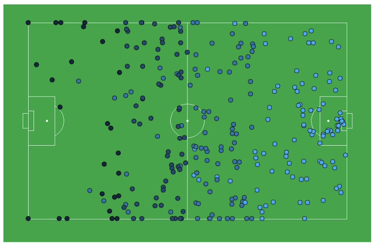{fig-align="center" width="95%"}
:::
::::
:::::::

::: notes
Field distribution of the labels in our database: failure, potential success and total success. The goal kick is from the left-hand goal.
:::

## 2.4 Variables: $\mathbb{R}^6$/Función objetivo {.con-cabecera}

Utilizaremos un conjunto de *Redes Neuronales* y como la muestra es pequeña un método de *validación cruzada* (cross validation) para mejorar el rendimiento

::: img-slide
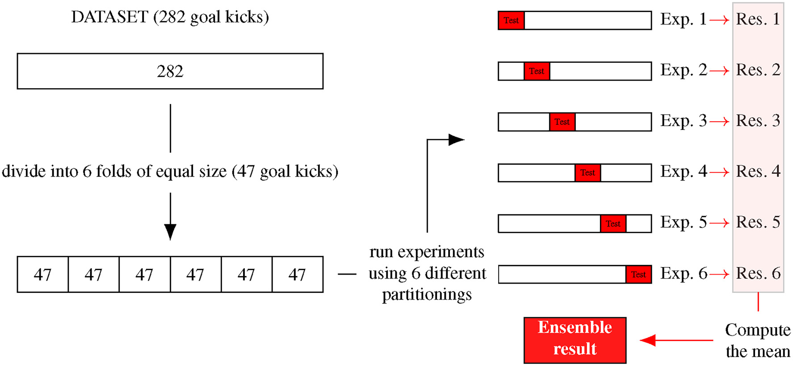{fig-align="center" width="75%"}
:::

::: notes
Hablar aqui de la partición y utilización de estas particiones para: test, training y validation
:::

## 2.4 Variables: $\mathbb{R}^6$/Función objetivo {.con-cabecera}

| Layers | Neurons |   LR | Param |  Loss |   Accuracy |
|:------:|:--------|-----:|------:|------:|-----------:|
|   1    | 16      | 0.10 |   195 | 1.017 | **0.5656** |
|   1    | 15      | 0.10 |   183 | 0.998 |     0.5585 |
|   1    | 31      | 0.10 |   375 | 1.005 |     0.5585 |
|   1    | 39      | 0.10 |   471 | 1.043 |     0.5532 |
|  ...   | ...     |  ... |   ... |   ... |        ... |

::: box-football
**Best model:** 1 hidden layer, 16 neurons, learning rate = 0.10.
:::

::: notes
Hablar aqui de que la arquitectura de una RN se basa en: 1.-Número de capas 2.-Número de neuronas por capa 3.-Funciones de activación
:::

## 2.4 Variables: $\mathbb{R}^6$/Función objetivo {.con-cabecera}

::: img-slide
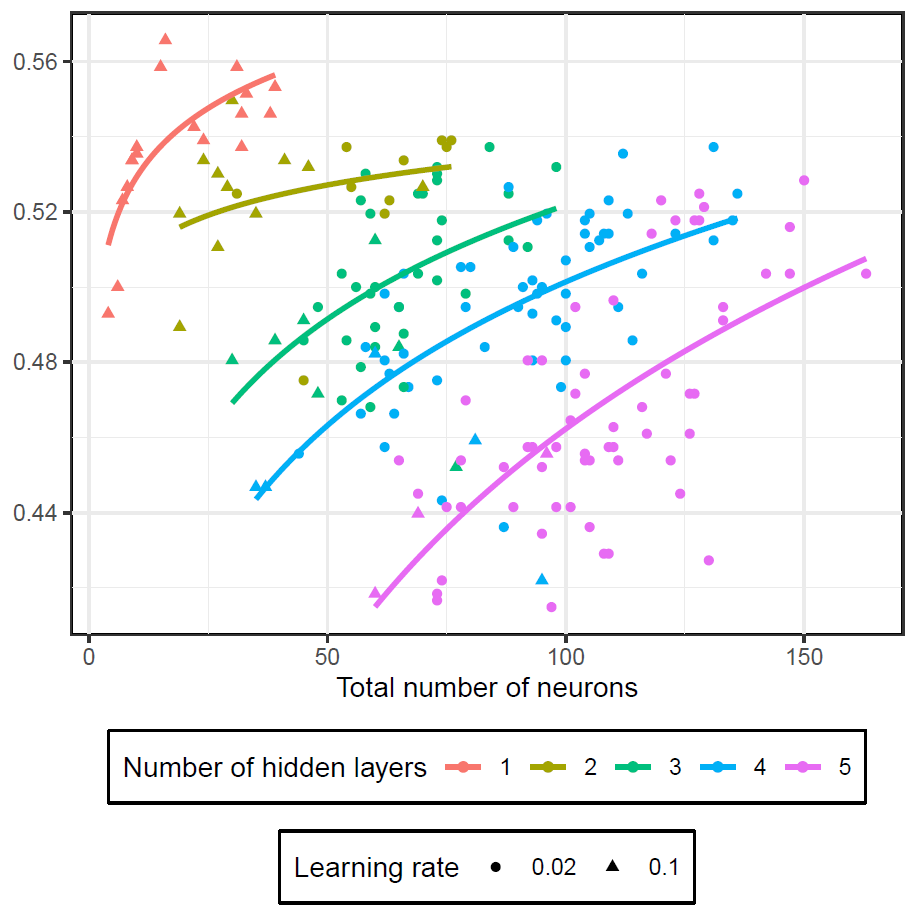{fig-align="center" width="100%"}
:::

## 2.4 Variables: $\mathbb{R}^6$/Función objetivo {.con-cabecera}

**Funciones de activación**

::: {.box-football .fragment data-fragment-index="1"}
\-*para las primeras capas:*

$$
\mathrm{ReLU}(x)=\max(0,x)=\begin{cases}
    x,&x>0\\
    0,&x\leq 0
\end{cases}
$$ for $x \in \mathbb R$, applied independently on each component.
:::

::: {.box-football .fragment data-fragment-index="2"}
\-*para la última capa:* $$
\mathrm{SoftMax}(\bar x)_i=\frac{e^{x_i}}{\sum_{j=1}^3 e^{x_j}},
$$ for $\bar x = ( x_1, x_2, x_3 ) \in \mathbb R$ and $i = 1, 2, 3$.
:::

::: notes
comentar que la fucnión deactivación f(x) = x se utiliza mucho porque NO tiene cálculos. Y cque cuando se tiene una RN que finaliza con 3-4 opciones se utiliza la función SoftMax porque te da también el % de probabilidad de que la función de ese resultado y aporta más información.
:::

## 2.5 Resultado {.con-cabecera}

::::::: columns
:::: {.column width="50%"}
::: {.data-box .fragment data-fragment-index="1"}
| Metric    |     Value |
|-----------|----------:|
| Accuracy  | **0.543** |
| Precision |     0.531 |
| Recall    |     0.537 |
| F1-Score  |     0.524 |
:::
::::

:::: {.column width="50%"}
::: {.data-box .fragment data-fragment-index="2"}
| Success Class |  F1-Score |
|---------------|----------:|
| 1             |     0.559 |
| 2             |     0.394 |
| **3**         | **0.618** |
:::
::::
:::::::

::: {.box-football .fragment data-fragment-index="3"}
Best class performance was obtained for **Success Class 3** ($F1=0.618$).
:::

::: notes
La precisión final no es muy grande. Ya lo intuiamos porque teniamos pocos datos de partida. Pero el modelo es interesante para aplicarlo a ligas enteras con más temporadas donde aumentan los datos
:::

# 3 Modelo Matemático para el Estudio de Métricas Defensivas en el Fútbol: Presiones Individuales, Colectivas y del partido. {.con-cabecera}

::: roadmap
-   1 · Introducción
-   2 · Uso de Redes Neuronales y Análisis Clúster Jerárquico en el Estudio de los Saques de Puerta en el Fútbol.
-   [⚽ 3 · Modelo Matemático para el Estudio de Métricas Defensivas en el Fútbol: Presiones Individuales, Colectivas y del partido.]{.active}
-   4 · Marco Dinámico para la Evaluación de la Presión Defensiva en el Fútbol.
-   5 · Firma Defensiva del Jugador: Caracterización de la Agresividad y la Consistencia en la Presión Defensiva.
-   6 . Discusión y conclusiones.
:::

# 3 Modelo Matemático para el Estudio de Métricas Defensivas en el Fútbol: Presiones Individuales, Colectivas y del partido. {.con-cabecera}

::: img-slide
[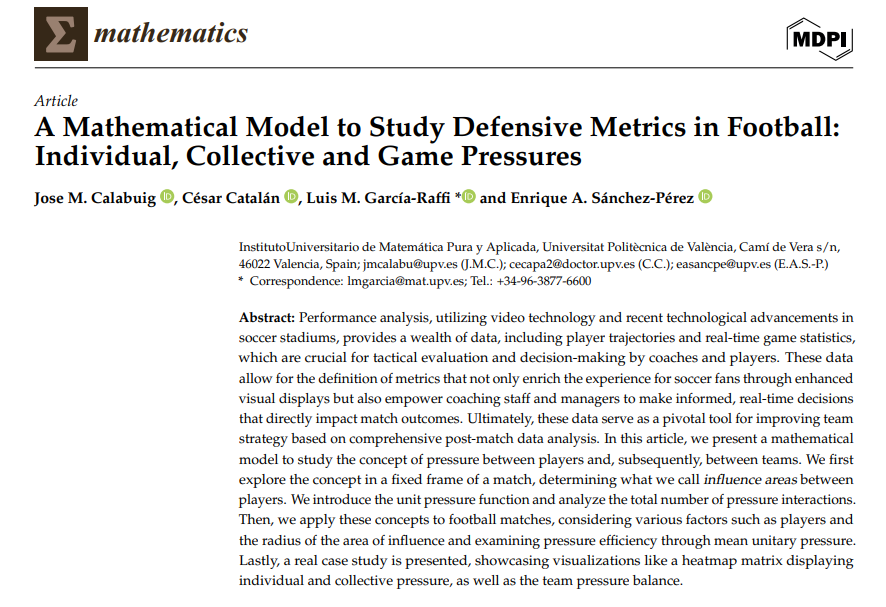{fig-align="center" width="100%"}](https://www.mdpi.com/2227-7390/12/23/3854)
:::

::: notes
:::

## 3.1 Area de inlfluecia {.con-cabecera}

::: data-box
For a fixed $r>0$, we define the **influence area between players** $\mathbf{a\in A}$ and $\mathbf{b\in B}$ as the truncated area of $B(a,r)\cap B(b,r)$.

$$
\mathscr{A}_{a,b}^{r}
=
\mathscr{A}^{r}(d_{a,b})
=
\begin{cases}
2r^{2}\arccos\!\left(\dfrac{d_{a,b}}{2r}\right)
-\dfrac{d_{a,b}}{2}\sqrt{4r^{2}-d_{a,b}^{2}},
&
0\le d_{a,b}\le r,\\\\
0,
&
d_{a,b}>r.
\end{cases}
$$

where

$$
d_{a,b}=\|a-b\|_2
$$

is the Euclidean distance between both players, and $a$ and $b$ denote their coordinates in $\mathbb{R}^{2}$.
:::

## 3.1 Area de inlfluecia {.con-cabecera}

::: img-slide
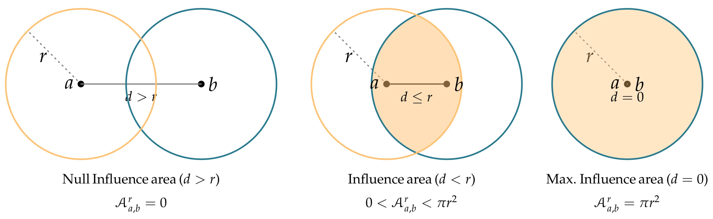{fig-align="center" width="100%"}
:::

## 3.2 Presión defensiva {.con-cabecera}

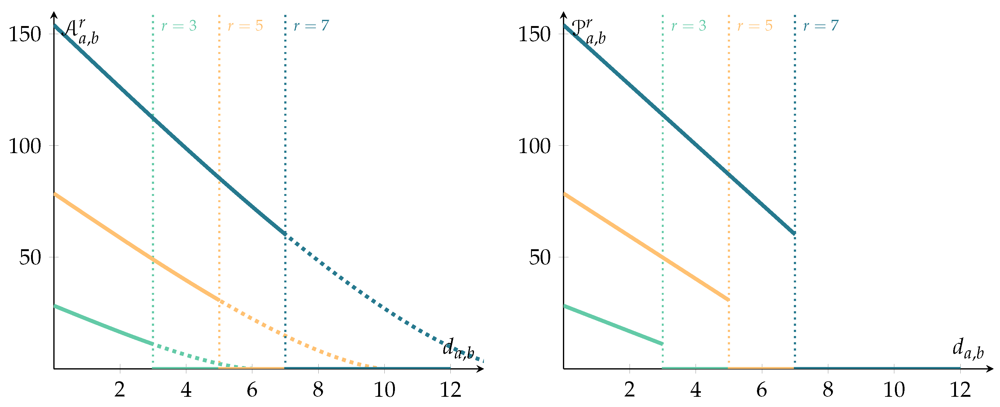{fig-align="center" width="100%"}

::::::::: columns
::::: {.column width="60%"}
:::: {.box-football .fragment data-fragment-index="1"}
::: {style="font-size:75%;"}
$$
    \mathscr{P}^r_{a,b}=\mathscr{P}^r(d_{a,b}):= \left\{
    \begin{array}{lcl}
           \pi r^2- \Big(\frac\pi 3+\frac{\sqrt{3}}2\Big)rd_{a,b}\, , & 0 \leq d_{a,b}\leq r \, , \\
    0,& d_{a,b}>r \, .
    \end{array}
    \right.
$$
:::
::::
:::::

::::: {.column width="40%"}
:::: {.box-football .fragment data-fragment-index="2"}
::: {style="font-size:75%;"}
$$
p^r_{a,b}=\frac{\mathscr{P}^r_{a,b}}{f_{max}}=\frac 1{\pi r^2}\,\mathscr{P}^r_{a,b}
$$
:::
::::
:::::
:::::::::

## 3.3 Agregación espacial/Interacciones {.con-cabecera}

::: img-slide
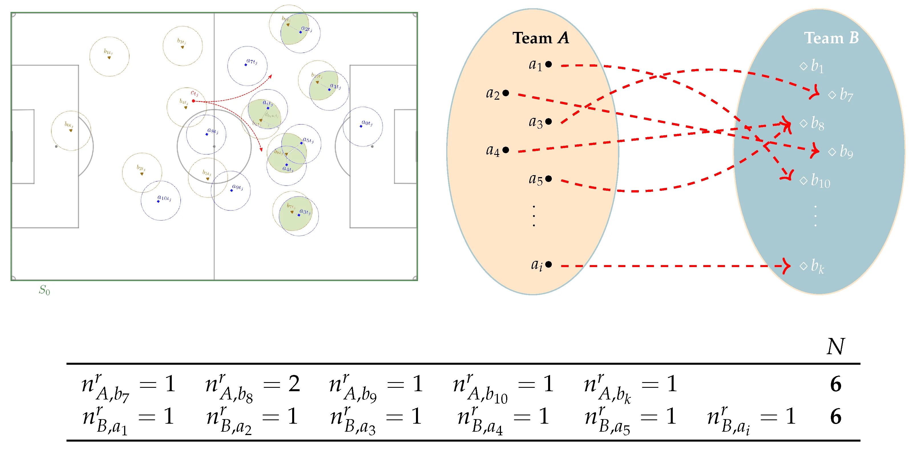{fig-align="center" width="100%"}
:::

## 3.4 Agregación espacial/Presiones grupales {.con-cabecera}

:::::::::::: columns
:::::: {.column width="50%"}
::: box-football
{fig-align="center" width="100%"}
:::

:::: {.box-football .fragment data-fragment-index="1"}
::: {style="font-size:75%;"}
$$
n_{A,b}=\mathrm{card}\big(\{a\in A:\mathscr P^r_{a,b}\neq0\}\big)
\rightarrow N=\sum_{b\in B}n_{A,b}
$$
:::
::::
::::::

::::::: {.column width="50%"}
:::: {.box-football .fragment data-fragment-index="2"}
::: {style="font-size:75%;"}
Presión ejercida del equipo A sobre el jugador b:\
$$\mathscr{P}^r_{A,b}=\displaystyle\sum_{a\in A}  \mathscr{P}^r_{a,b}$$
:::
::::

:::: {.box-football .fragment data-fragment-index="3"}
::: {style="font-size:75%;"}
Presión ejercida del equipo A sobre el equipo B: $$\mathscr{P}^r_{A,B}=\sum_{b\in B} \mathscr{P}^r_{A,b}=\sum_{b\in B}  \sum_{a\in A}  \mathscr{P}^r_{a,b}$$
:::
::::
:::::::
::::::::::::

## 3.5 Agregación temporal {.con-cabecera}

::: box-football
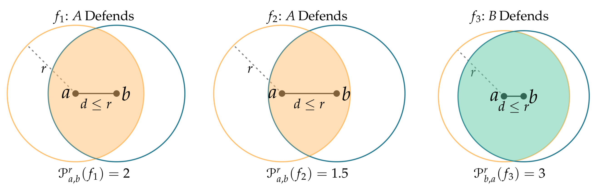{fig-align="center" width="75%"}
:::

:::: box-football
::: {style="font-size:100%;"}
Presión ejercida por el jugador $\pmb{a\in A}$ sobre el jugador $\pmb{b\in B}$ durante todo un periodo $\pmb{\mathscr F_A}$

$$
\mathscr{P}^r_{a,b}(\mathscr F)=\sum_{f\in \mathscr F_A} \mathscr{P}^r_{a,b}(f)
$$
:::
::::

## 3.5 Agregación temporal/Presiones grupales {.con-cabecera}

:::: box-football
::: {style="font-size:75%;"}
Presión ejercida por el equipo $\pmb A$ sobre el jugador $\pmb{b\in B}$ durante todo un periodo $\pmb{\mathscr F}$: $$
\mathscr P^r_{A,b}(\mathscr F)=\sum_{a\in A} \mathscr P^r_{a,b}(\mathscr F)
                        =\sum_{a\in A} \sum_{f\in \mathscr F_A} \mathscr P^r_{a,b}(f)
$$
:::
::::

:::: {.box-football .fragment}
::: {style="font-size:75%;"}
Presión ejercida por el equipo $\pmb A$ sobre el equipo $\pmb B$ durante todo un periodo $\pmb{\mathscr F}$: $$
\mathscr P^r_{A,B}(\mathscr F)=\sum_{b\in B} \mathscr P^r_{A,b}(\mathscr F)
                        =\sum_{b\in B} \sum_{a\in A} \mathscr P^r_{a,b}(\mathscr F)
                        =\sum_{b\in B}  \sum_{a\in A} \sum_{f\in \mathscr F_A} \mathscr P^r_{a,b}(f)
$$
:::
::::

::::: {.box-football .fragment}
::: {style="font-size:75%;"}
$$p^r_{a,b}(\mathscr F)=\frac{\mathscr{P}^r_{a,b}(\mathscr F)}{\pi r^2}=\frac 1{\pi r^2} \sum_{f\in \mathscr F_A} \mathscr{P}^r_{a,b}(f)$$
:::

::: {style="font-size:75%;"}
$$\widehat{p}^{\,\, r}_{a,b}(\mathscr{F})=\frac {p_{a,b}^r(\mathscr F)}{\mathrm{card}(\mathscr F_A^a)}=\frac 1{\mathrm{card}(\mathscr F_A^a)} \frac 1{\pi r^2} \sum_{f\in \mathscr F_A} \mathscr{P}^r_{a,b}(f)$$
:::
:::::

## 3.6 Determinación del radio {.con-cabecera}

::: {.img-slide .fragment}
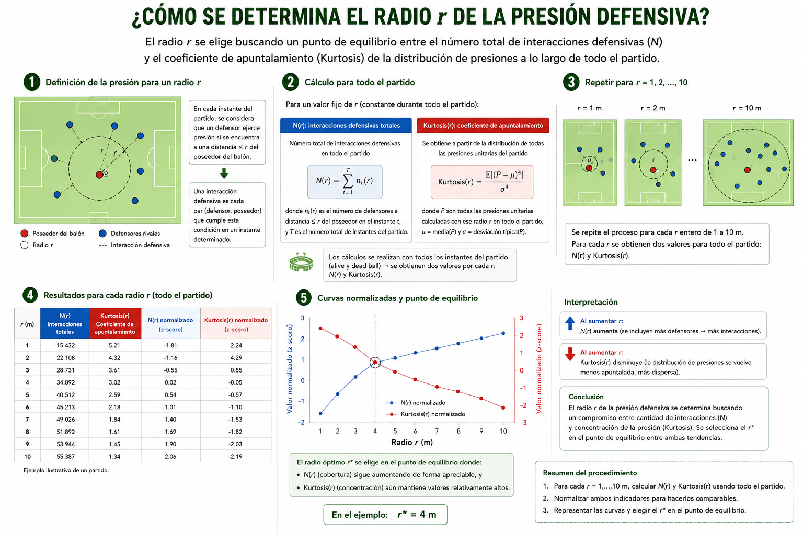{fig-align="center" width="100%"}
:::

## 3.6 Determinación del radio/Numero interacciones {.con-cabecera}

::: img-slide
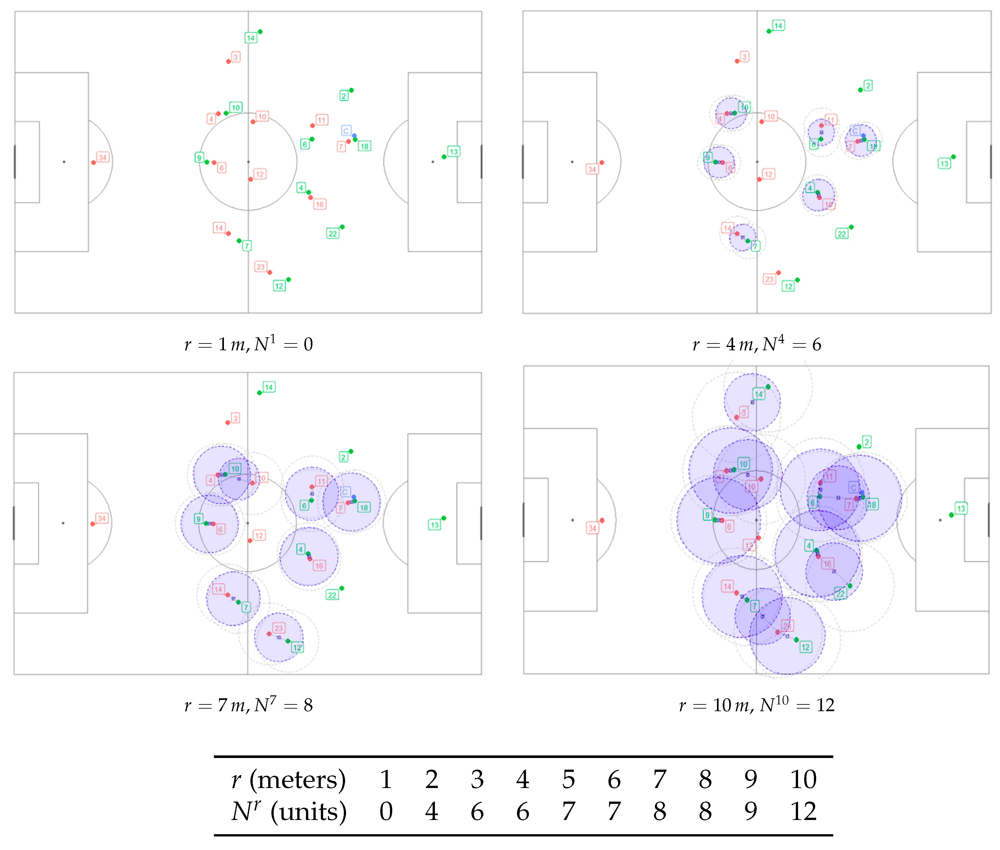{fig-align="center" width="100%"}
:::

## 3.6 Determinación del radio/Dispersión resultados {.con-cabecera}

::: img-slide
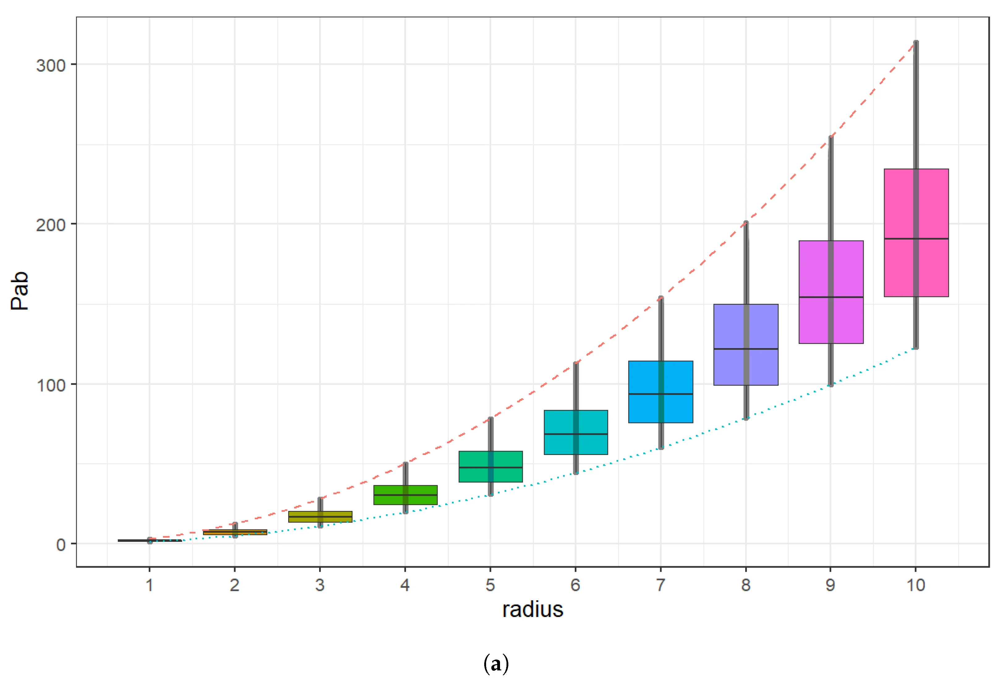{fig-align="center" width="100%"}
:::

## 3.6 Determinación del radio/Tipologia interacciones {.con-cabecera}

::: img-slide
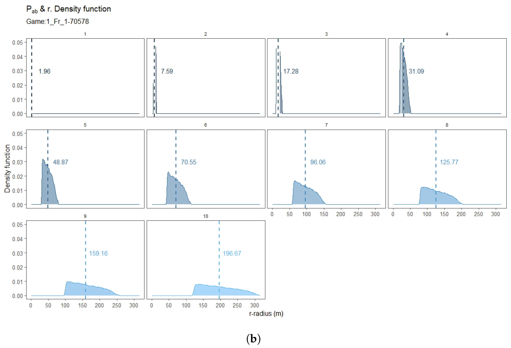{fig-align="center" width="100%"}
:::

## 3.6 Determinación del radio/Kurtosis & Interacciones {.con-cabecera}

::: img-slide
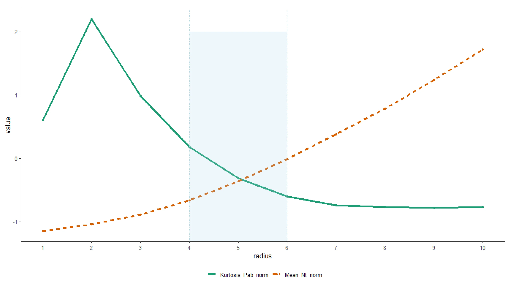{fig-align="center" width="100%"}
:::

## 3.7 Resultados/Matriz de Presiones {.con-cabecera}

::::::: columns
:::: {.column width="50%"}
::: box-football
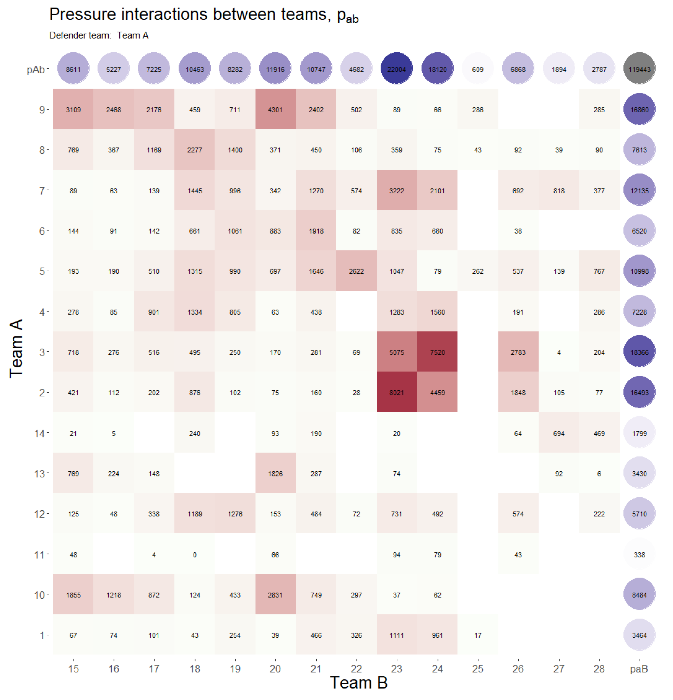{fig-align="center" width="90%"}
:::
::::

:::: {.column width="50%"}
::: box-football
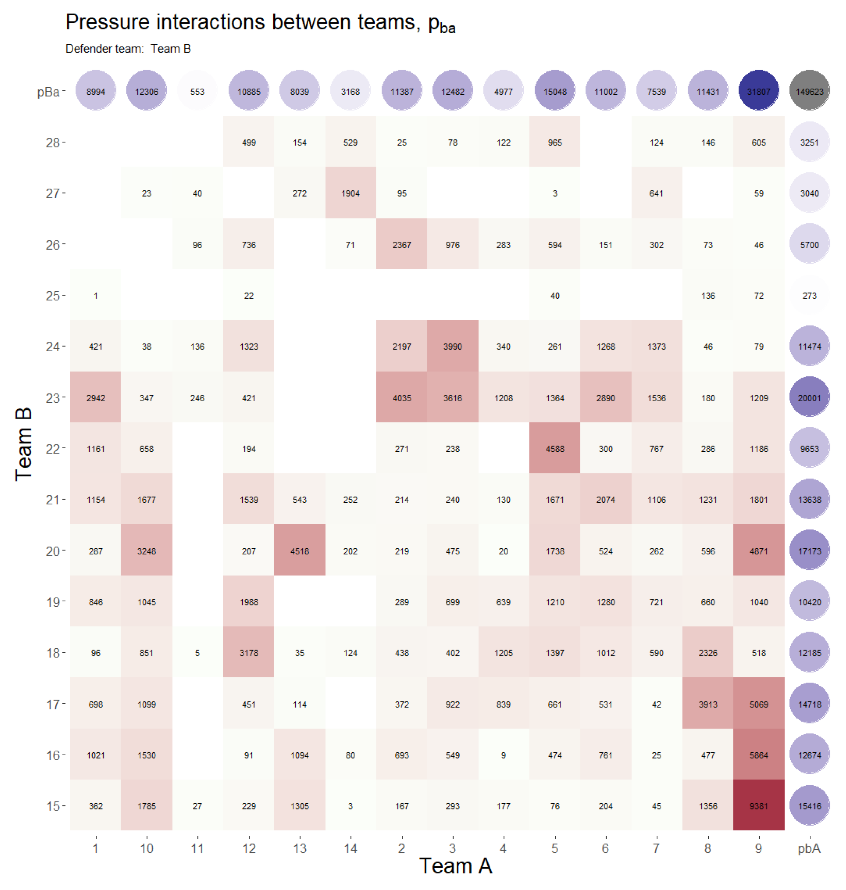{fig-align="center" width="90%"}
:::
::::
:::::::

## 3.7 Resultados/Butterfly {.con-cabecera}

::: img-slide
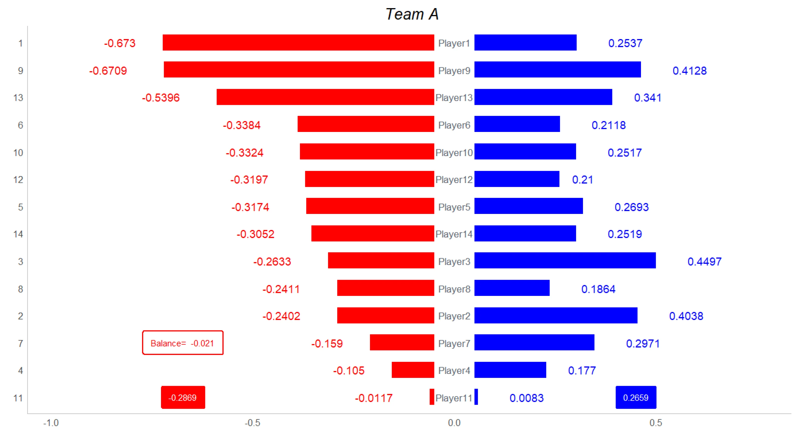{fig-align="center" width="90%"}
:::

## 3.7 Resultados/Butterfly {.con-cabecera}

::: img-slide
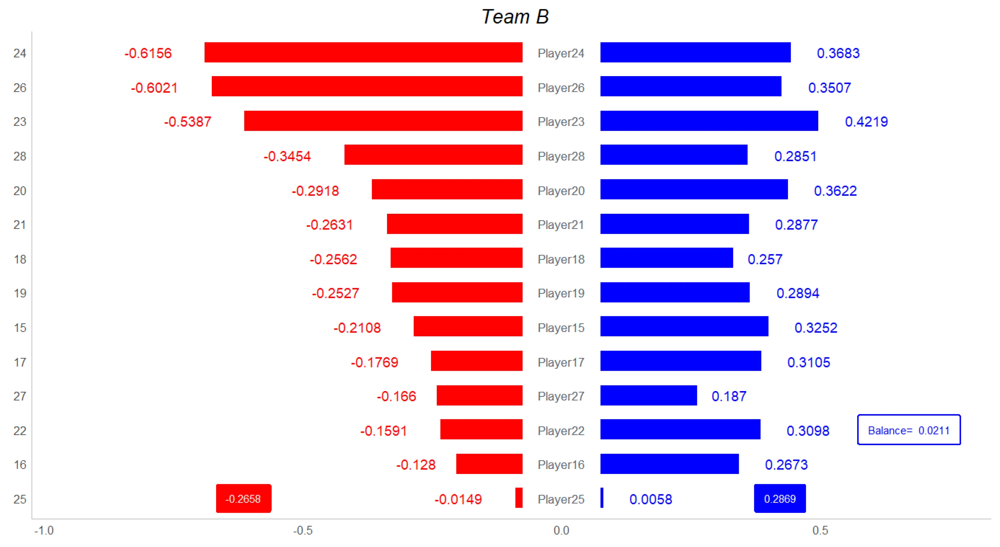{fig-align="center" width="90%"}
:::

# 4 Marco Dinámico para la Evaluación de la Presión Defensiva en el Fútbol. {.con-cabecera}

::: roadmap
-   1 · Introducción
-   2 · Uso de Redes Neuronales y Análisis Clúster Jerárquico en el Estudio de los Saques de Puerta en el Fútbol.
-   3 · Modelo Matemático para el Estudio de Métricas Defensivas en el Fútbol: Presiones Individuales, Colectivas y del partido.
-   [⚽ 4 · Marco Dinámico para la Evaluación de la Presión Defensiva en el Fútbol.]{.active}
-   5 · Firma Defensiva del Jugador: Caracterización de la Agresividad y la Consistencia en la Presión Defensiva.
-   6 . Discusión y conclusiones.
:::

# 4 Marco Dinámico para la Evaluación de la Presión Defensiva en el Fútbol. {.con-cabecera}

::: img-slide
[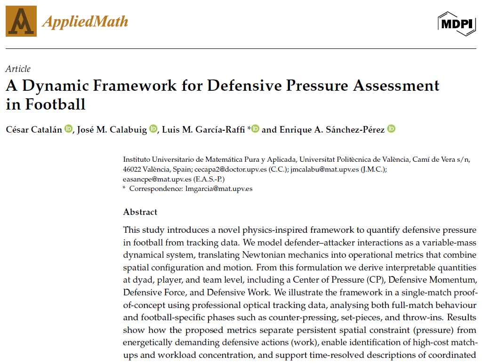{fig-align="center" width="100%"}](https://doi.org/10.3390/appliedmath6060082)
:::

::: notes
:::

## 4.1 Presión defensiva/CP {.con-cabecera}

:::::::: columns
:::: {.column width="60%"}
::: {.box-football .fragment data-fragment-index="1"}
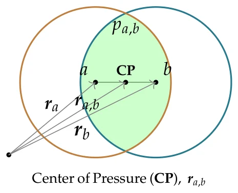{fig-align="center" width="75%"}
:::
::::

::::: {.column width="40%"}
:::: {.box-football .fragment data-fragment-index="2"}
::: {style="font-size:75%;"}
We define the **Center of Pressure (CP)** between players $\boldsymbol{a\in A}$ and $\boldsymbol{b \in B}$ at time $\boldsymbol{t}$, denoted by $\boldsymbol{r}_{a,b}(t)$, as the average value of the position vectors of these players, $\boldsymbol{r}_a(t)$ and $\boldsymbol{r}_b(t)$,\
$$\boldsymbol{r}_{a,b}(t)=\frac{1}{2}\left(\boldsymbol{r}_a(t)+\boldsymbol{r}_b(t)\right)$$
:::
::::
:::::
::::::::

## 4.1 Presión defensiva/CP Cinematica {.con-cabecera}

:::::::: columns
:::: {.column width="60%"}
::: box-football
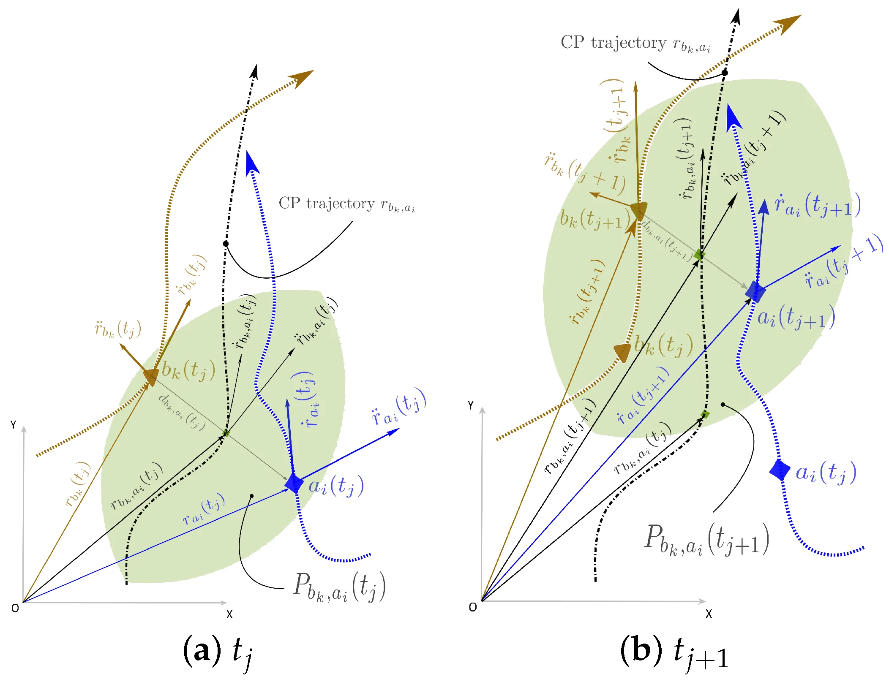{fig-align="center" width="90%"}
:::
::::

::::: {.column width="40%"}
:::: {.box-football .fragment data-fragment-index="2"}
::: {style="font-size:75%;"}
$$\boldsymbol{r}_{a,b}(t)=\frac{1}{2}\left(\boldsymbol{r}_a(t)+\boldsymbol{r}_b(t)\right)$$

$$\boldsymbol{\dot r}_{a,b}=\frac{d}{dt}[\boldsymbol{r}_{a,b}]=\frac{1}{2}\left(\boldsymbol{\dot{r}}_a+\boldsymbol{\dot{r}}_b\right),$$ $$\boldsymbol{\ddot r}_{a,b}=\frac{d^2}{dt^2}[\boldsymbol{r}_{a,b}]=\frac{1}{2}\left(\boldsymbol{\ddot {r}}_a+\boldsymbol{\ddot{r}}_b\right)$$
:::
::::
:::::
::::::::

## 4.1 Presión defensiva/CP Cinematica {.con-cabecera}

::: img-slide
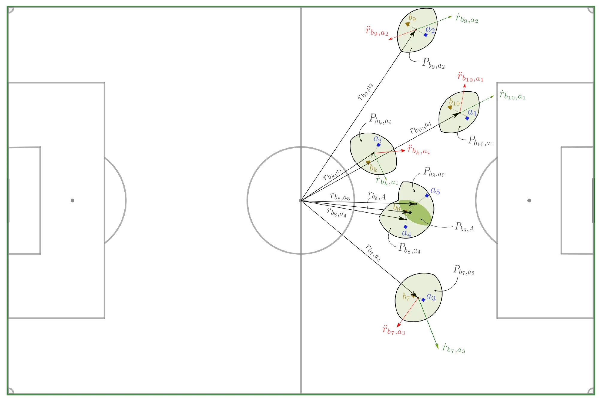{fig-align="center" width="100%"}
:::

## 4.1 Presión defensiva/CP Simulación {.con-cabecera}

<video autoplay loop controls muted playsinline style="display:block; margin:auto; max-width:90%; max-height:75vh;">

<source src="Videos/Cap4_1_Fr115789-116289_r5_BallLost(Fr-115814)_Analizar.mp4" type="video/mp4">

</video>

## 4.2 Sistema Dinamico Presiones/Equivalencia sistema Newtoniano {.con-cabecera}

::::::: box-football
:::::: {style="font-size:100%;color:darkblue;"}
Equivalencia física y matemática entre un **sistema dinámico de partículas de masa variable** y las interacciones de presión defensiva observadas en el fútbol.

3 leyes del Sistema Newtoniano:

::: fragment
-   la primera ley sustenta la hipótesis de que el terreno de juego puede considerarse un **sistema de referencia inercial**
:::

::: fragment
-   la segunda proporciona una definición rigurosa de la **Fuerza Defensiva** como la derivada temporal del Momento Defensivo
:::

::: fragment
-   la tercera refleja la **reciprocidad** de las interacciones entre jugadores y oponentes
:::
::::::
:::::::

## 4.2 Sistema Dinamico Presiones/Presión defensiva {.con-cabecera}

::: {style="font-size:100%;color:darkblue;"}
DINÁMICA DE MASAS $$
  M(t) [Kg] = \rho \left[\frac{Kg}{m^2}\right] \cdot A(t)\left[m^2\right]
$$
:::

::: {.fragment style="font-size:100%;color:darkgreen;"}
DINÁMICA DEFENSIVA $$
  \mathscr{P}^r_{a,b}(t)\left[up\right] = \rho_{a,b}(t) \left[\frac{up}{m^2}\right] \cdot \mathscr{A}^r_{a,b}(t)\left[m^2\right]
$$
:::

::: {.fragment style="font-size:100%;color:darkgreen;"}
$$
  p^r_{a,b}(t)  \left[\frac{up}{m^2}\right] =
    \frac 1{\pi r^2} \left[\frac{1}{m^2}\right] \cdot \mathscr{P}^r_{a,b}(t)\left[up\right]
$$
:::

::: {.fragment style="font-size:75%;color:darkgreen;"}
```{=html}
<!--
$$\mathscr{A}^r_{a,b}(t):= \begin{cases}
         \displaystyle  \pi r^2- \big(\frac\pi 3+\frac{\sqrt{3}}2\big)rd_{a,b}\, , & 0 \leq d_{a,b}\leq r, \\
    0,& d_{a,b}>r.
    \end{cases}$$

-->
```

$\rho_{a,b}(t)$ es la densidad de presión ($up/m^2$).

$ρ_{a,b}(t) = ρ = 1 (up/m2)$ en este estudio.
:::

::: notes
El modelo tiene como objetivo establecer una equivalencia física y matemática entre un sistema dinámico de partículas de masa variable y las interacciones de presión defensiva observadas en el fútbol. En la mecánica clásica, un sistema de partículas con masa variable se caracteriza por cambios continuos en las masas que lo constituyen, lo que, a su vez, afecta al momento, la fuerza y el trabajo del sistema a lo largo del tiempo. Por analogía, en el fútbol, la presión defensiva ejercida por los jugadores puede considerarse una entidad de «masa variable»: la magnitud y la localización de las presiones fluctúan dinámicamente a medida que los jugadores se aproximan o se alejan entre sí, entran o salen de la zona de presión, o modifican su rol táctico.

---which $\rho_{a,b}(t)$ can be interpreted as the intensity per unit influence area assigned to the interaction---

In the present study, we assume a constant pressure density ρa,b(t) = ρ = 1 (up/m2) for all player interactions and a time dependence of Ar a,b(t). This assumption should be interpreted as a baseline normalisation rather than as an empirical statement that all defensive interactions have identical tactical value. It allows the model to isolate the contribution of inter-player geometry and CP motion, thereby making the derived quantities directly interpretable and comparable. Future extensions of the framework may define ρa,b(t) as a contextual density depending on ball distance, distance to goal, pitch zone, player velocity, or game state. Sensitivity analyses with respect to both ρ and the interaction radius r therefore constitute an important direction for future validation.
:::

## 4.2 Sistema Dinamico Presiones/Momentum {.con-cabecera}

::: {style="font-size:100%;color:darkblue;"}
DINÁMICA DE MASAS $$
  \pmb{\mathscr{L}}_k(t)=m_k(t)\, \boldsymbol{\dot r}_k
$$
:::

::: {.fragment style="font-size:100%;color:darkgreen;"}
DINÁMICA DEFENSIVA $$
  \pmb{\mathscr{L}}_{a,b}(t)=p_{a,b}(t)\, \boldsymbol{\dot r}_{a,b}
$$
:::

::: notes
In a dynamic system of particles with variable mass, the linear momentum Lk(t) of a particle k of mass mk(t) in a reference frame ϕ is a time-dependent vector quantity defined as the product of the instantaneous mass mk(t) of the particle and its velocity ˙rk in ϕ,

The Defensive Momentum $\pmb{\mathscr{L}}_{a,b}(t)$ is therefore directly proportional to both the magnitude of the pressure exerted between two players and to the velocity of its \textbf{CP}. Hence, defensive activity increases either when the pressure itself intensifies (i.e., smaller inter-player distance) or when the CP moves more rapidly across the pitch. By construction, $\pmb{\mathscr{L}}_{a,b}(t)$ has the same direction as the \textbf{CP} velocity $\bm{\dot r}_{a,b}$, reflecting the spatial orientation of the defensive action.
:::

## 4.2 Sistema Dinamico Presiones/Fuerza {.con-cabecera}

::: {style="font-size:100%;color:darkblue;"}
DINÁMICA DE MASAS $$
  \pmb{\mathscr{F}}_k(t)=\frac{d}{dt}\left[\pmb{\mathscr{L}}_k(t)\right]=\frac{d}{dt}\left[m_k(t) \, \boldsymbol{\dot r}_k\right]=\frac{d}{d t}[m_k(t)]\, \boldsymbol{\dot r}_k+m_k(t) \, \boldsymbol{\ddot r}_k
$$
:::

::: {.fragment style="font-size:100%;color:darkgreen;"}
DINÁMICA DEFENSIVA $$
    \pmb{\mathscr{F}}_{a,b}(t)=\frac{d}{d t}[\pmb{\mathscr{L}}_{a,b}(t)]=\frac{d}{d t}\left[p_{a,b}(t)\, \boldsymbol{\dot r}_{a,b}\right]=\frac{d}{d t}[p_{a,b}(t)]\, \boldsymbol{\dot r}_{a,b}+p_{a,b}(t)\, \boldsymbol{\ddot r}_{a,b}.
$$
:::

::: notes
In classical dynamics, according to the second law, the total force $\pmb{\mathscr{F}}_k(t)$ exerted on a particle $k$ in a reference frame $\phi$ is equal to the time derivative of its linear momentum (\cite{MThomaz:2019}). In the case of a system with variable mass

We define the **Defensive Force** between player $\bm{a \in A}$ and player $\bm{b \in B}$ at time $\bm{t}$ and located at their Center of Pressure, as the time derivative of their defensive momentum

It is important to note that this magnitude explicitly captures pressure in motion. A player a ∈ A may exert static pressure on an opponent b ∈ B, but such pressure only contributes to the Defensive Momentum if the velocity of the CP is non-zero, $ra,b <>  0$. In other words, Defensive Momentum quantifies the dynamic component of pressing actions, rather than static proximity alone. This property is particularly relevant when considered alongside Defensive Force and Defensive Work—both of which are detailed in the following sections—as it provides a comprehensive description of the intensity and temporal evolution of defensive behaviour.

Por analogía con la mecánica, $F_{a,b}(t)$ puede interpretarse como el «empuje efectivo» que un defensor ejerce sobre un oponente, cuantificado mediante su capacidad para acelerar y sostener la presión en el contexto espacio-temporal del juego.
:::

## 4.2 Sistema Dinamico Presiones/Trabajo {.con-cabecera}

::: {style="font-size:100%;color:darkblue;"}
DINÁMICA DE MASAS $$
  \mathscr{W}_k=\int_{\Gamma} \pmb{\mathscr F}_k(t)\cdot d\boldsymbol{\mathbf{s}}_k(t), \qquad\text{where} \; d\boldsymbol{\mathbf{s}}_k(t)= \boldsymbol{\dot r}_k(t)dt
$$
:::

::: {.fragment style="font-size:100%;color:darkgreen;"}
DINÁMICA DEFENSIVA $$
    \mathscr{W}_{a,b}=\sum_{f \in \mathbb{F}_{a,b}}\pmb{\mathscr{F}}_{a,b}(t_f)\cdot \Delta\boldsymbol{\mathbf{s}}_{a,b}(t_f), \qquad
        \text{where}    \; \Delta \boldsymbol{\mathbf{s}}_{a,b}(t_f)=\boldsymbol{\dot r}_{a,b}(t_f)\frac 1h.
$$
:::

## 4.2 Sistema Dinamico Presiones/Metricas Agregadas {.con-cabecera auto-animate="true"}

::: box-football
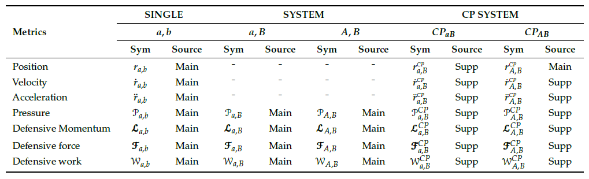{fig-align="center" width="75%"}
:::

::: {.box-football .fragment style="font-size:100%;color:darkgreen;"}
$$\mathscr{P}_{a,B}(t)=\sum_{b\in B} \mathscr{P}_{a,b}(t) \quad , \quad
        \mathscr{P}_{A,B}(t)=\sum_{a\in A} \mathscr{P}_{a,B}(t)=\sum_{a\in A}  \sum_{b\in B}  \mathscr{P}_{a,b}(t)$$
:::

## 4.2 Sistema Dinamico Presiones/Metricas Agregadas {.con-cabecera auto-animate="true"}

::: box-football
{fig-align="center" width="75%"}
:::

::: {.box-football style="font-size:100%;color:darkgreen;"}
$$\pmb{\mathscr L}_{A,B}(t) =\displaystyle\sum_{b \in B}\displaystyle\sum_{a \in A}\pmb{\mathscr L}_{a,b}(t) \qquad \text{and} \qquad {\mathscr LT}_{A,B}(t) =\displaystyle\sum_{b \in B}\displaystyle\sum_{a \in A}\left\|\pmb{\mathscr L}_{a,b}(t)\right\|_2 $$
:::

## 4.2 Sistema Dinamico Presiones/Metricas Agregadas {.con-cabecera auto-animate="true"}

::: box-football
{fig-align="center" width="75%"}
:::

::: {.box-football style="font-size:100%;color:darkgreen;"}
$$\pmb{\mathscr{F}}_{A,B}(t) =\displaystyle\sum_{b \in B}\displaystyle\sum_{a \in A}\pmb{\mathscr{F}}_{a,b}(t) $$
:::

## 4.2 Sistema Dinamico Presiones/Metricas Agregadas {.con-cabecera auto-animate="true"}

::: box-football
{fig-align="center" width="75%"}
:::

::: {.box-football style="font-size:100%;color:darkgreen;"}
$$\mathscr{W}_{A,B}=\sum_{f\in \mathbb F_{A}}\displaystyle\sum_{b \in B}\displaystyle\sum_{a \in A}\pmb{\mathscr{F}}_{a,b}(t_f)\cdot \Delta\boldsymbol{s}_{a,b}(t_f) $$
:::

## 4.2 Sistema Dinamico Presiones/Metricas Agregadas {.con-cabecera auto-animate="true"}

::: box-football
{fig-align="center" width="75%"}
:::

::: {.box-football style="font-size:100%;color:darkgreen;"}
$$\mathscr{P}^{\,CP}_{A,B}(t)=\mathscr{P}_{A,B}(t)=\displaystyle\sum_{b\in B}  \sum_{a\in A}  \mathscr{P}_{a,b}(t)$$
:::

## 4.2 Sistema Dinamico Presiones/Metricas Agregadas {.con-cabecera auto-animate="true"}

::: box-football
{fig-align="center" width="75%"}
:::

::: {.box-football style="font-size:100%;color:darkgreen;"}
$$\boldsymbol{r}^{\scriptscriptstyle{\,CP}}_{A,B}(t)=\dfrac1{{\mathscr{P}_{A,B}(t)}} \displaystyle\sum_{b \in B}\displaystyle\sum_{a \in A}\mathscr{P}_{a,b}(t)\boldsymbol {r}_{{a,b}}(t)$$
:::

## 4.2 Sistema Dinamico Presiones/Metricas Agregadas {.con-cabecera auto-animate="true"}

::: box-football
{fig-align="center" width="75%"}
:::

::: {.box-football style="font-size:60%;color:darkgreen;"}
$$\begin{align}\boldsymbol{\dot r}^{\scriptscriptstyle{\,CP}}_{A,B}(t)=&\frac{d}{dt}\left[ \boldsymbol{r}^{\scriptscriptstyle{\,CP}}_{A,B}(t) \right]
        =\dfrac{1}{\mathscr{P}_{A,B}(t)}\displaystyle\sum_{b \in B}\displaystyle\sum_{a \in A}\mathscr{P}_{a,b}(t)\boldsymbol{\dot{r}}_{a,b}(t)\nonumber \\
        +&\dfrac{1}{\mathscr{P}_{A,B}(t)}\left[\displaystyle\sum_{b \in B}\displaystyle\sum_{a \in A}\mathscr{\dot P}_{a,b}(t)\boldsymbol{r}_{a,b}(t)-\dfrac{\mathscr{\dot P}_{A,B}(t)}{\mathscr{P}_{A,B}(t)}\boldsymbol{r}^{\scriptscriptstyle{\,CP}}_{A,B}(t)\right]\end{align}$$
:::

## 4.2 Sistema Dinamico Presiones/Metricas Agregadas {.con-cabecera auto-animate="true"}

::: box-football
{fig-align="center" width="75%"}
:::

::: {.box-football style="font-size:100%;color:darkgreen;"}
$$\boldsymbol{\ddot r}^{\scriptscriptstyle{\,CP}}_{A,B}(t)=\frac{d}{dt}\left[ \boldsymbol{r}^{\scriptscriptstyle{\,CP}}_{A,B}(t) \right]$$
:::

## 4.2 Sistema Dinamico Presiones/Metricas Agregadas {.con-cabecera auto-animate="true"}

::: box-football
{fig-align="center" width="75%"}
:::

::: {.box-football style="font-size:100%;color:darkgreen;"}
$$\pmb{\mathscr L}_{A,B}^{CP}(t)= \pmb{\mathscr L}_{A,B}(t)+\displaystyle\sum_{b \in B}\displaystyle\sum_{a \in A}\mathscr{\dot P}_{a,b}(t)\boldsymbol{r}_{a,b}(t)-\dfrac{\mathscr{\dot P}_{A,B}(t)}{\mathscr{P}_{A,B}(t)}\boldsymbol{r}^{\scriptscriptstyle{\,CP}}_{A,B}(t)$$
:::

## 4.2 Sistema Dinamico Presiones/Metricas Agregadas {.con-cabecera auto-animate="true"}

::: box-football
{fig-align="center" width="75%"}
:::

::: {.box-football style="font-size:60%;color:darkgreen;"}
$$\begin{align}
        \pmb{\mathscr F}_{A,B}^{CP}(t)=&\frac{d}{dt} \left[\pmb{\mathscr L}_{A,B}^{CP}(t)\right]=\pmb{\mathscr F}_{A,B}(t) + \frac{d}{dt}\left[\displaystyle\sum_{b \in B}\displaystyle\sum_{a \in A}\mathscr{\dot P}_{a,b}(t)\boldsymbol{r}_{{a,b}}(t)-\dfrac{\mathscr{\dot P}_{A,B}(t)}{\mathscr{P}_{A,B}(t)}\boldsymbol{r}^{\scriptscriptstyle{\,CP}}_{{A,B}}(t)\right]=\nonumber\\
        =&\, \pmb{\mathscr F}_{A,B}(t)+\displaystyle\sum_{b \in B}\displaystyle\sum_{a \in A}\mathscr{\ddot P}_{a,b}(t)\boldsymbol{r}_{{a,b}}(t)+\displaystyle\sum_{b \in B}\displaystyle\sum_{a \in A}\mathscr{\dot P}_{a,b}(t)\boldsymbol{\dot r}_{{a,b}}(t) -\left(\dfrac{\mathscr{\ddot P}_{A,B}(t)}{\mathscr{P}_{A,B}(t)}-\dfrac{\mathscr{\dot P}^2_{A,B}(t)}{\mathscr{P}^2_{A,B}(t)}\right)\boldsymbol{r}^{\scriptscriptstyle{\,CP}}_{{A,B}}(t)-\dfrac{\mathscr{\dot P}_{A,B}(t)}{\mathscr{P}_{A,B}(t)}\boldsymbol{\dot r}^{\scriptscriptstyle{\,CP}}_{{A,B}}(t)
\end{align}$$
:::

## 4.2 Sistema Dinamico Presiones/Metricas Agregadas {.con-cabecera auto-animate="true"}

::: box-football
{fig-align="center" width="75%"}
:::

::: {.box-football style="font-size:100%;color:darkgreen;"}
$$\mathscr{W}_{A,B}^{CP}=\sum_{f \in \mathbb F_A }\pmb{\mathscr F}_{A,B}^{CP}(t_f)\cdot \Delta \boldsymbol{s}^{CP}_{A,B}(t_f),  
        \quad \text{where}  \quad \Delta\boldsymbol{s}^{CP}_{A,B}(t)=\boldsymbol{\dot{r}}^{CP}_{{A,B}}(t)h^{-1}$$
:::

## 4.2 Sistema Dinamico Presiones/Contruccion modelo/Simulación metodologia {.con-cabecera}

::: img-slide
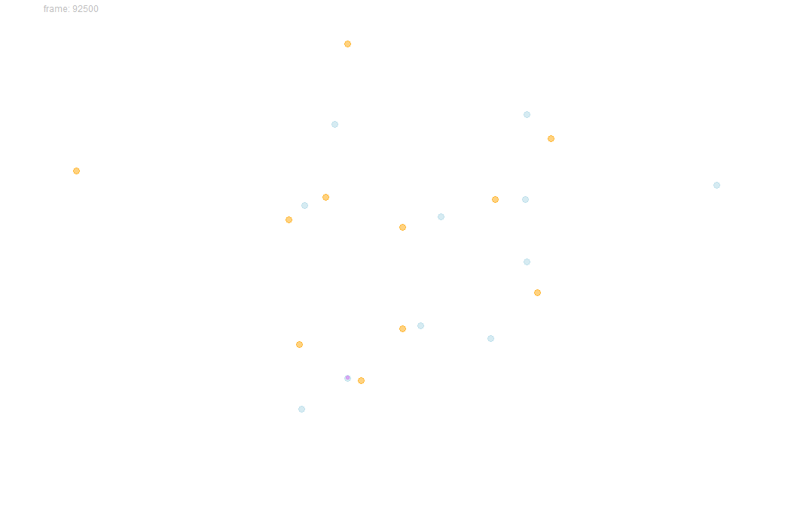{fig-align="center" width="100%"}
:::

## 4.2 Sistema Dinamico Presiones/Contruccion modelo/Simulación metodologia real {.con-cabecera}

<video autoplay loop controls muted playsinline style="display:block; margin:auto; max-width:90%; max-height:75vh;">

<source src="Videos/Cap4_SimulacionModelo.mp4" type="video/mp4">

</video>

## 4.3 Sistema Dinamico Presiones/Resultados/Evaluacion del modelo {.con-cabecera}

::: data-box
📁 **Dataset utilizado**

🔗 [Metrica Sports – Sample Data](https://github.com/metrica-sports/sample-data){target="_blank"}

**Archivos**

-   `Sample_Game_3_metadata.xml`
-   `Sample_Game_3_events.json`
-   `Sample_Game_3_tracking.txt`
:::

::: notes
:::

## 4.3 Sistema Dinamico Presiones/Resultados/Analisis Presiones-Trabajo {.con-cabecera}

::: {.img-slide .fragment}
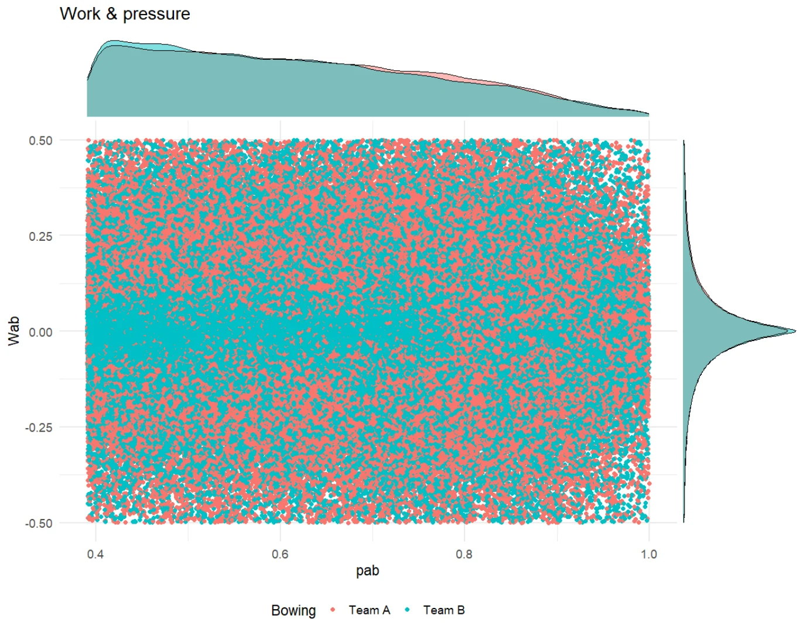{fig-align="center" width="100%"}
:::

## 4.3 Sistema Dinamico Presiones/Resultados/Analisis Presiones-Trabajo {.con-cabecera}

::: img-slide
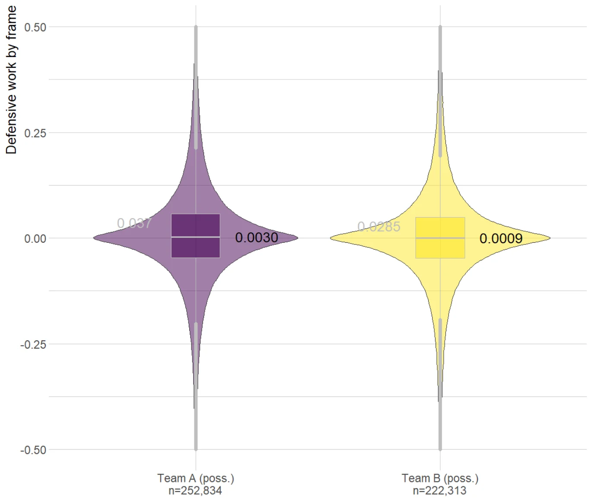{fig-align="center" width="100%"}
:::

## 4.3 Sistema Dinamico Presiones/Resultados/Trabajo defensivo interacciones {.con-cabecera}

::::::: columns
:::: {.column width="50%"}
::: box-football
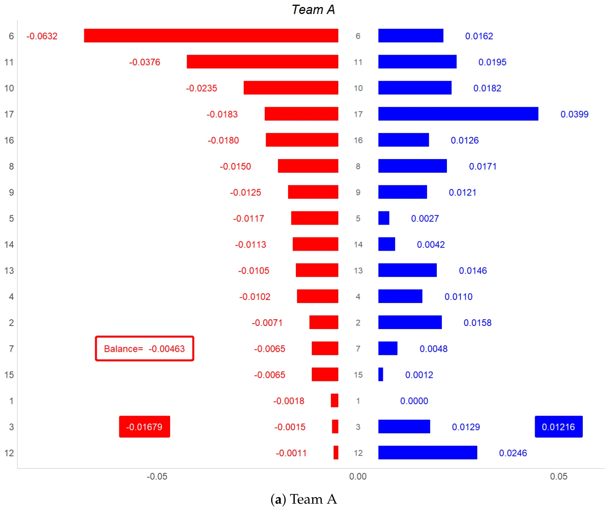{fig-align="center" width="95%"}
:::
::::

:::: {.column width="50%"}
::: box-football
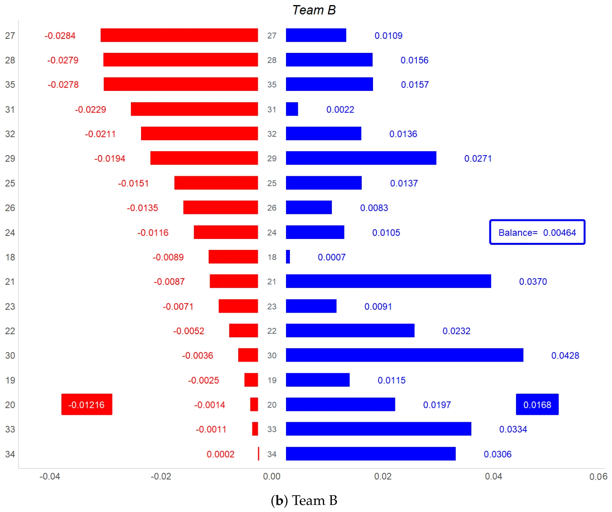{fig-align="center" width="95%"}
:::
::::
:::::::

## 4.3 Sistema Dinamico Presiones/Resultados/Trabajo defensivo interacciones {.con-cabecera}

::::::: columns
:::: {.column width="50%"}
::: box-football
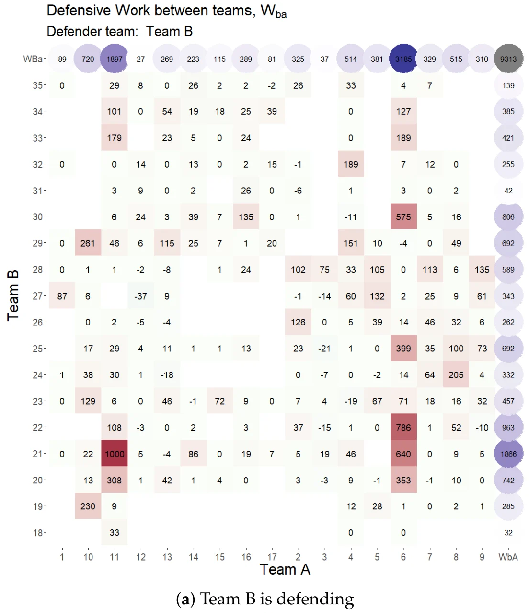{fig-align="center" width="75%"}
:::
::::

:::: {.column width="50%"}
::: box-football
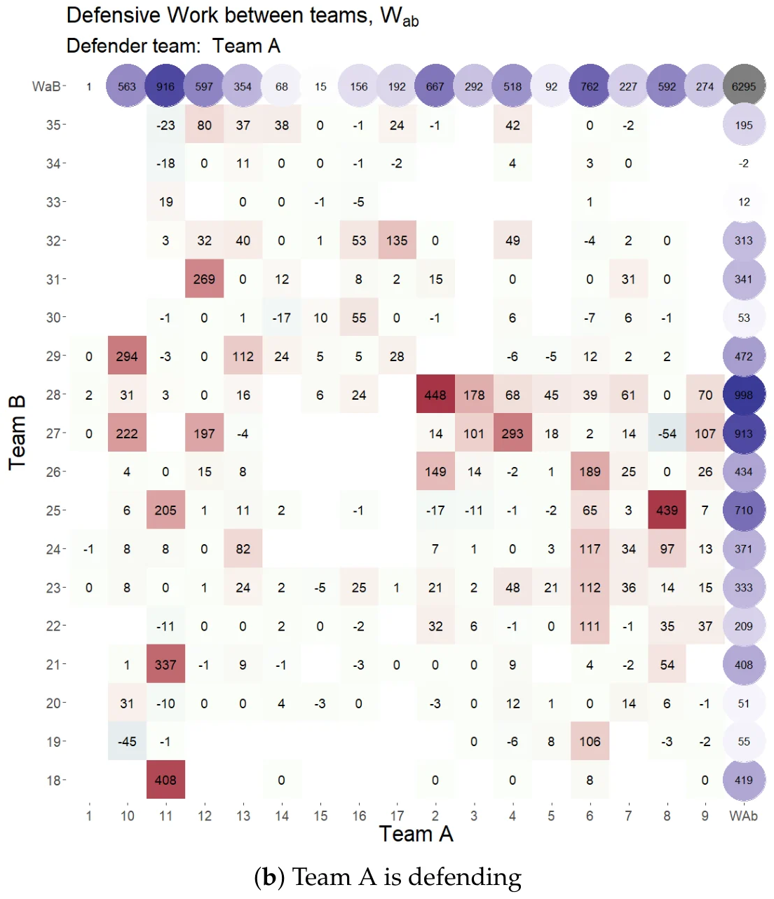{fig-align="center" width="75%"}
:::
::::
:::::::

::: notes
| **Equipo defensor** | **Diadas** | **Top-5** | **Top-10** |  **Gini** |
|:--------------------|-----------:|----------:|-----------:|----------:|
| Team B              |    **214** | **27.8%** |  **44.9%** | **0.782** |
| Team A              |    **217** | **34.9%** |  **48.8%** | **0.785** |
:::

## 4.3 Sistema Dinamico Presiones/Resultados/Trabajo defensivo interacciones {.con-cabecera}

::: img-slide
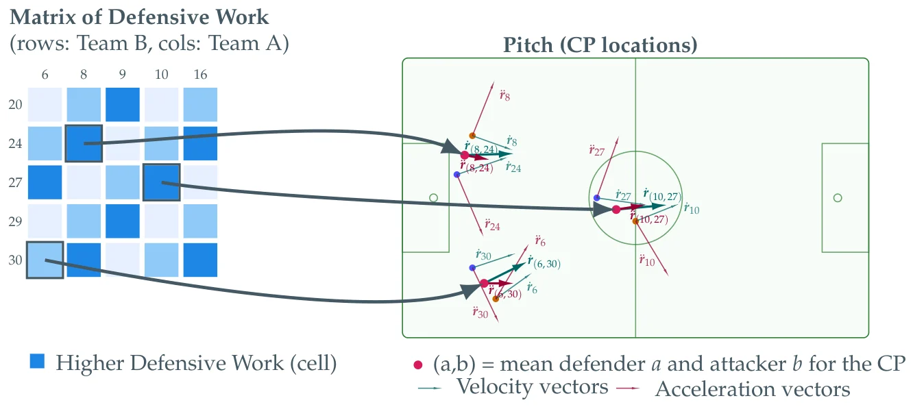{fig-align="center" width="100%"}
:::

## 4.3 Sistema Dinamico Presiones/Resultados/Acciones defensivas de alta intensidad {.con-cabecera}

::::::: columns
:::: {.column width="70%"}
::: box-football
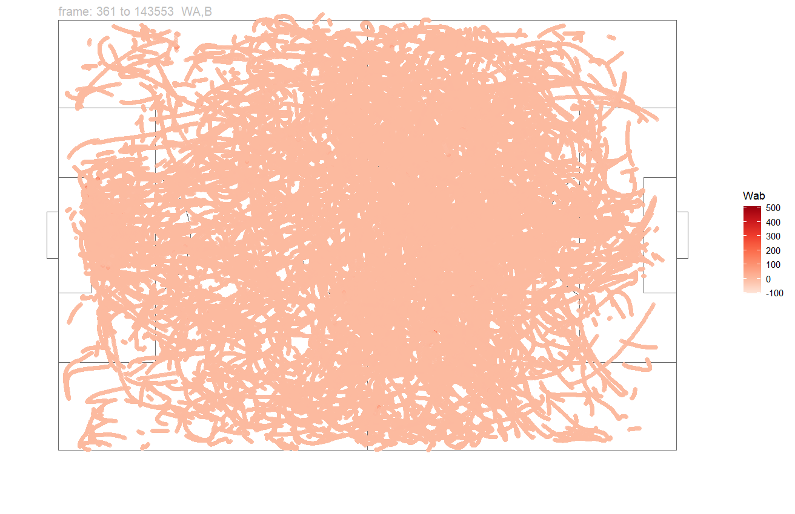{fig-align="center" width="90%"}
:::
::::

:::: {.column width="30%"}
::: {.box-football .fragment}
{fig-align="center" width="95%"}

Threshold para el **trabajo defensivo** entre equipos y jugador-equipo, $\mathscr W > Q_{99}$.
:::
::::
:::::::

## 4.3 Sistema Dinamico Presiones/Resultados/Acciones defensivas de alta intensidad {.con-cabecera}

::: img-slide
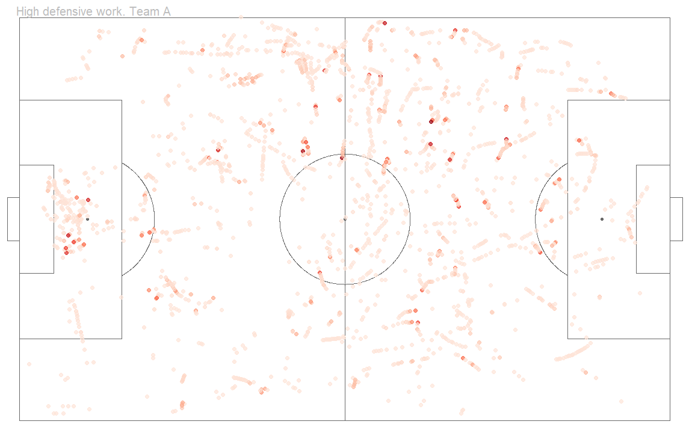{fig-align="center" width="100%"}
:::

::: notes
Team A-\> (attack direction: right to left) shows a concentration of high-work actions in advanced zones near the opponent’s penalty area, whereas Team B (attack direction: left to right) displays a wider distribution of such events across different areas of the pitch.
:::

## 4.3 Sistema Dinamico Presiones/Resultados/Acciones defensivas de alta intensidad {.con-cabecera}

::: img-slide
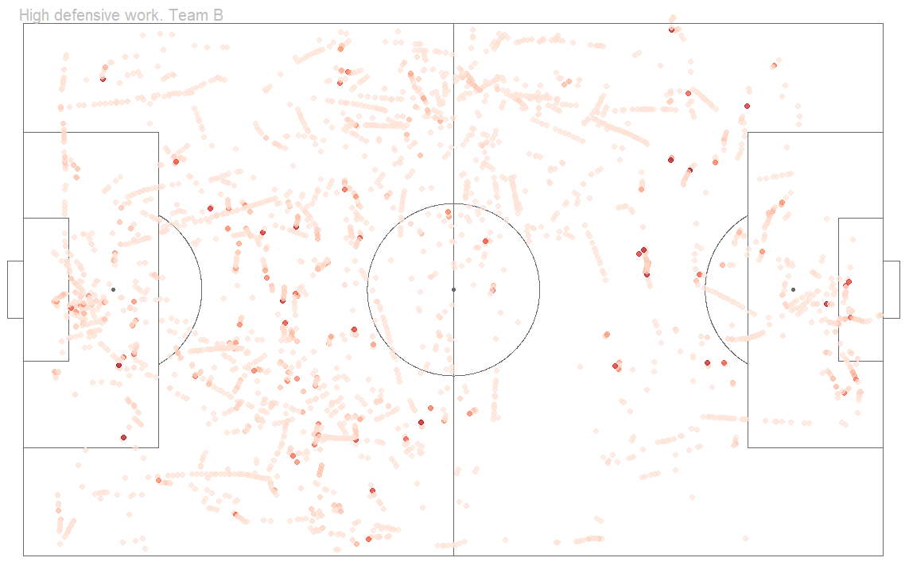{fig-align="center" width="100%"}
:::

::: notes
Team B-\> (attack direction: left to right) displays a wider distribution of such events across different areas of the pitch.
:::

## 4.3 Sistema Dinamico Presiones/Resultados/Acciones defensivas de alta intensidad {.con-cabecera}

::: img-slide
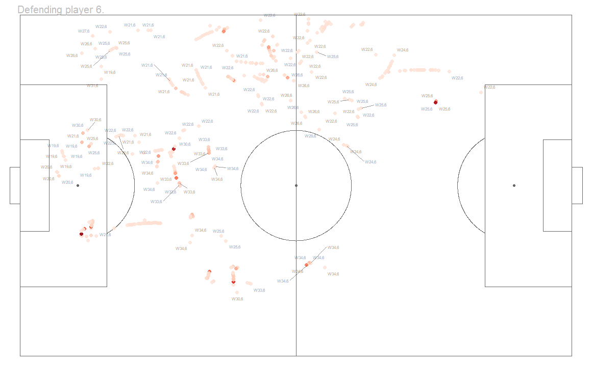{fig-align="center" width="100%"}
:::

::: notes
:::

## 4.3 Sistema Dinamico Presiones/Resultados/Acciones defensivas de alta intensidad {.con-cabecera}

::::::: columns
:::: {.column width="70%"}
::: {.box-football .fragment}
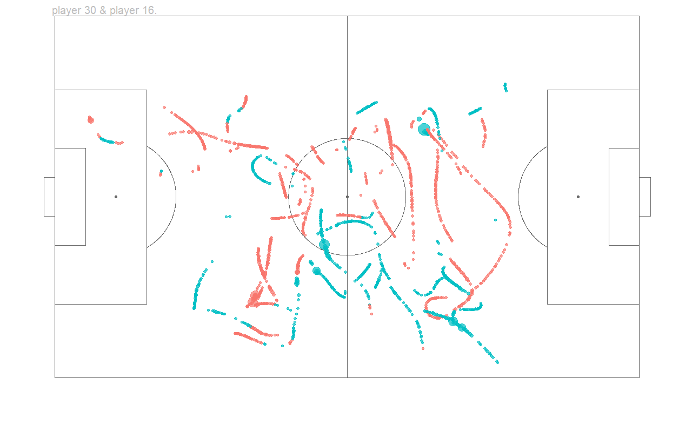{fig-align="center" width="90%"}
:::
::::

:::: {.column width="30%"}
::: box-football
Threshold para el **trabajo defensivo** entre jugador-jugador, $\mathscr W > Q_{75}$.
:::
::::
:::::::

## 4.3 Sistema Dinamico Presiones/Resultados/Dinámica temporal durante la presión tras pérdida {.con-cabecera}

::: img-slide
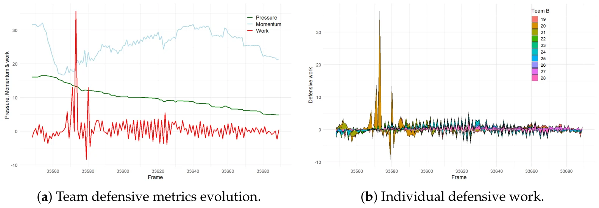{fig-align="center" width="100%"}
:::

::: notes
Figures 4.12a and 4.12b analyse a 6-second counter-press. Team-level metrics show Pressure declining as the attack develops, while a sharp rise and convergence in Momentum indicates the onset of coordinated pressing in motion. Peaks in Defensive Work reflect intense duels. Player contributions reveal the reaction was initiated by the nearest defender (Player 20), with tracking back from others (Players 21, 27) aligning the press, before wider players supported containment.
:::

## 4.3 Sistema Dinamico Presiones/Resultados/Dinámica temporal durante la presión tras pérdida {.con-cabecera}

::: img-slide
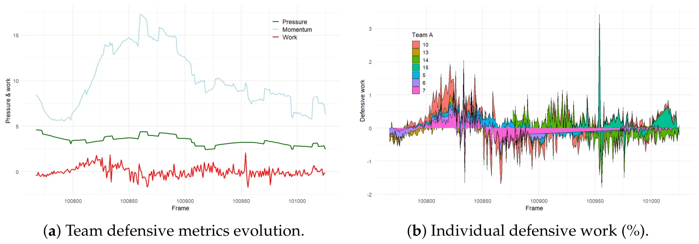{fig-align="center" width="100%"}
:::

::: notes
Figures 4.13a and 4.13b depict a longer 11-second counter-attack. Pressure is stable, while a pronounced rise in Momentum curve shows coherent pressing in motion. Sustained Defensive Work oscillations indicate prolonged effort. Player contributions shift from advanced players (10, 7) initially to midfield and defensive reinforcements (13, 14, 15) later.
:::

## 4.3 Sistema Dinamico Presiones/Resultados/Defensa de un saque de esquina {.con-cabecera}

::: img-slide
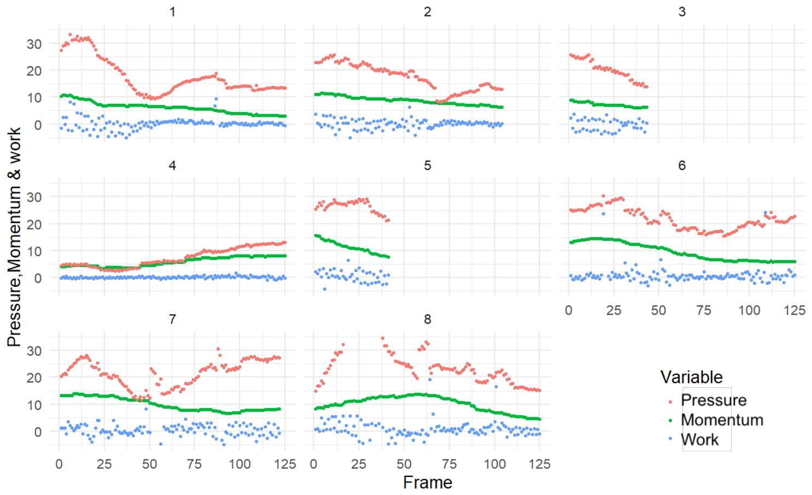{fig-align="center" width="100%"}
:::

::: notes
Figure 4.14: Defensive metrics for all match corners. General pattern shows high initial pressure decreasing post-delivery. Subfigures 4 and 8 exemplify how tactics and context alter the profile.
:::

## 4.3 Sistema Dinamico Presiones/Resultados/Defensa tras saque de banda {.con-cabecera}

::: img-slide
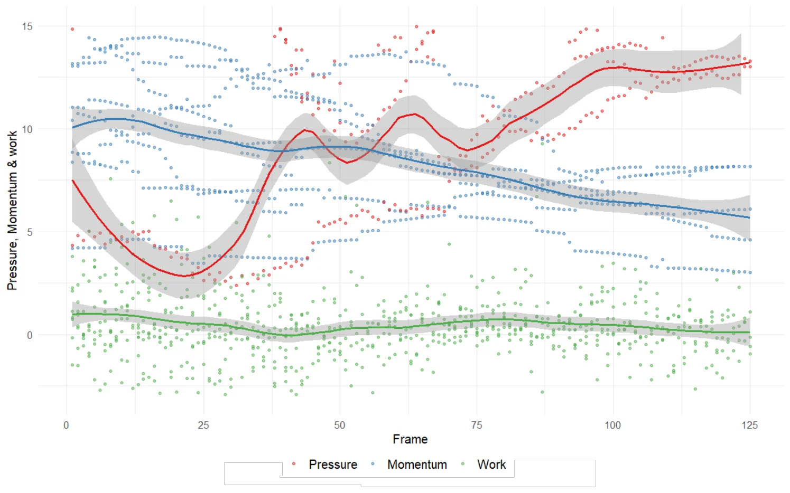{fig-align="center" width="100%"}
:::

::: notes
Figure 4.15 presents the aggregated profile of 50 throw-ins. Pressure rises gradually from a moderate baseline as play resumes. Momentum increases and converges, showing progressive defensive alignment. Defensive Work oscillates with small peaks, reflecting the low-to-moderate, repeated efforts characteristic of throw-in duels, contrasting with the sharper spikes seen in corners or counter-attacks.
:::

## 4.3 Sistema Dinamico Presiones/Resultados/Cuasi tiempo-real {.con-cabecera}

::::::: columns
:::: {.column width="50%"}
::: box-football
[Metodología y código fuente](https://cccapaccioni.github.io/ModellingFootball/Modelling/KPIs.html){target="_blank"}

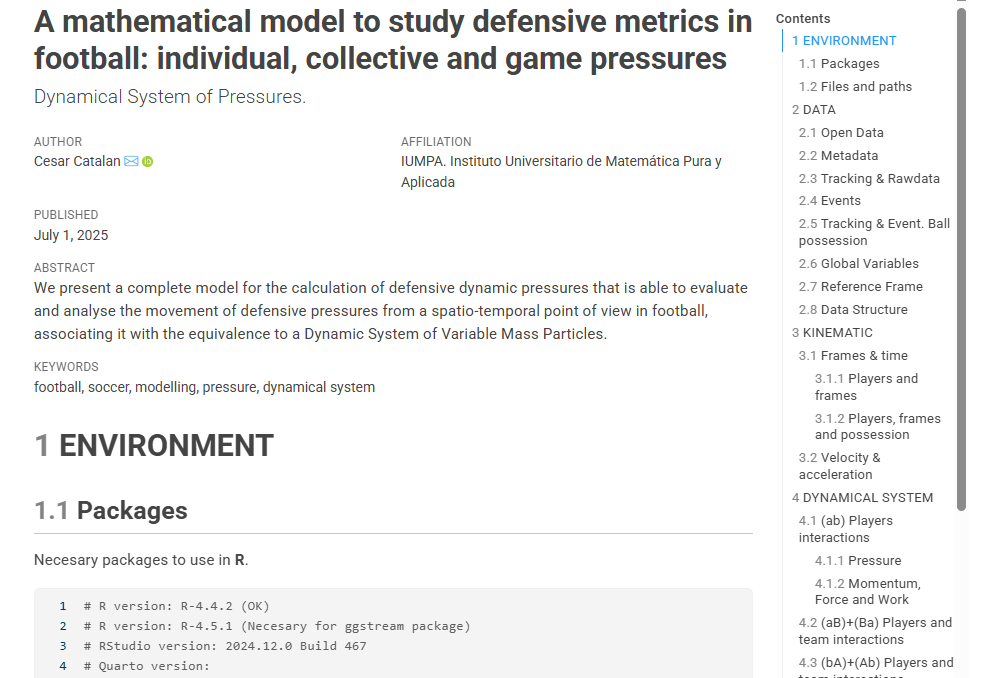{fig-align="center" width="95%"}
:::
::::

:::: {.column width="50%"}
::: {.box-football .fragment}
-   El cálculo completo de todas las métricas se completó en aproximadamente **tres minutos**.

-   La implementación se realizó en \texttt{R}, utilizando RStudio \cite{PositWebsiteR2} (versión 2024.12.0 Build 467), sobre un ordenador portátil con procesador Intel(R) Core(TM) i7-6700HQ a 2,60 GHz, 16 GB de memoria RAM y sistema operativo Windows x64.
:::
::::
:::::::

::: notes
Estos resultados ponen de manifiesto que el modelo puede aplicarse de forma eficiente incluso utilizando recursos computacionales convencionales, lo que respalda su utilización en escenarios de análisis próximos al tiempo real.
:::

## 4.3 Sistema Dinamico Presiones/Resultados/Herramientas de análisis/Simular y verificar {.con-cabecera}

::: {.img-slide .fragment}
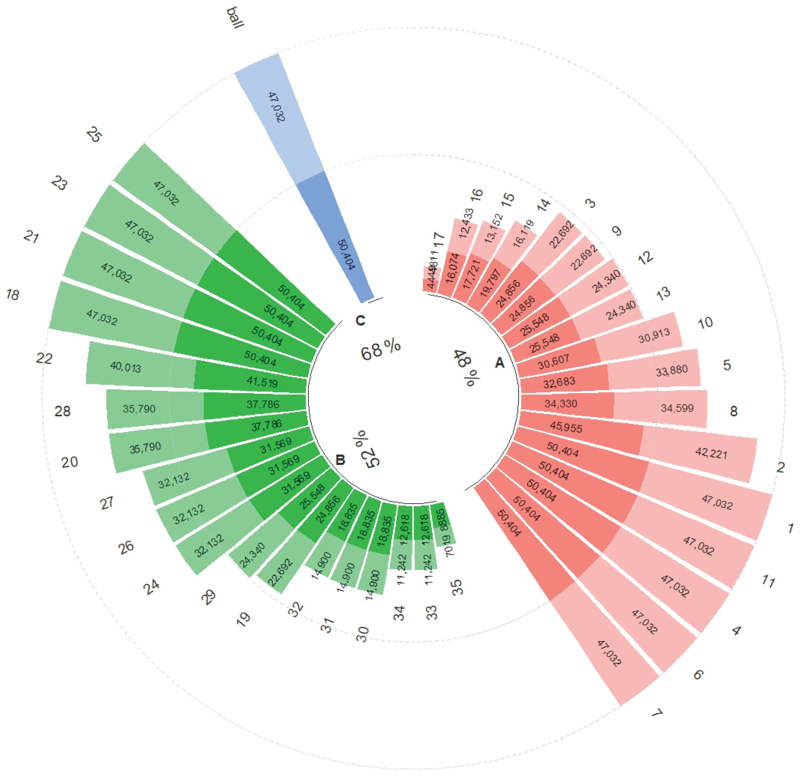{fig-align="center" width="100%"}
:::

::: notes
:::

# 5 Firma Defensiva del Jugador: Caracterización de la Agresividad y la Consistencia en la Presión Defensiva. {.con-cabecera}

::: roadmap
-   1 · Introducción
-   2 · Uso de Redes Neuronales y Análisis Clúster Jerárquico en el Estudio de los Saques de Puerta en el Fútbol.
-   3 · Modelo Matemático para el Estudio de Métricas Defensivas en el Fútbol: Presiones Individuales, Colectivas y del partido.
-   4 · Marco Dinámico para la Evaluación de la Presión Defensiva en el Fútbol.
-   [⚽ 5 · Firma Defensiva del Jugador: Caracterización de la Agresividad y la Consistencia en la Presión Defensiva.]{.active}
-   6 . Discusión y conclusiones.
:::

# 5 Firma Defensiva del Jugador: Caracterización de la Agresividad y la Consistencia en la Presión Defensiva. {.con-cabecera}

::: img-slide
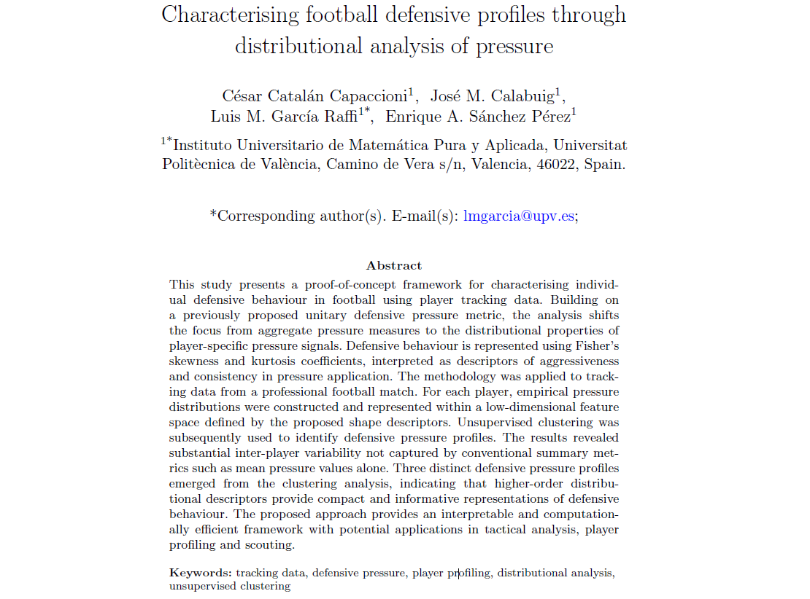{fig-align="center" width="100%"}
:::

::: notes
:::

## 5.1 Firma Defensiva del Jugador/Objetivos {.con-cabecera}

::: {.box-football .fragment}
-   Analizar la **forma de las distribuciones** de presión defensiva específicas de cada jugador, más que la magnitud de la presión en sí misma.
:::

::: {.box-football .fragment}
-   **Clasificar y agrupar** los jugadores en función de esa distribución defensiva con el fin de caracterizar la defensiva individual y basada en la métrica $p^r_{a,b}(t)$.
:::

::: {.box-football .fragment style="font-size:75%;color:darkgreen;"}
Por consiguiente, el *objetivo general* de este trabajo es evaluar si las métricas de presión desarrolladas permiten discriminar las **cualidades defensivas de los jugadores** de fútbol mediante la evaluación y comparación —tanto entre jugadores como entre equipos— de dos características fundamentales:

-   **la agresividad con la que se aproximan a los oponentes**
-   **la consistencia de su patrón de presión**.
:::

::: notes
:::

## 5.2 Firma Defensiva del Jugador/Metodologia {.con-cabecera}

::: img-slide
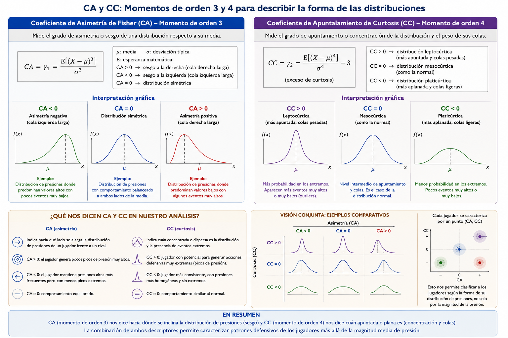{fig-align="center" width="100%"}
:::

::: notes
:::

## 5.2 Firma Defensiva del Jugador/Metodologia {.con-cabecera}

::::::: columns
:::: {.column width="50%"}
::: {.box-football style="font-size:75%;"}
**CA**

$$
\begin{equation}
    CA{p}_{a,B} =
    \frac{
        \displaystyle\sum_{b \in B} \sum_{f \in \mathscr{F}_B}
        \left(p_{a,b}(f) - \bar{p}_{a,B}\right)^3
    }{
        n_{a,B}(\mathscr{F}) \cdot \sigma_{p_{a,B}}^{3}
    }
\end{equation}
$$
:::
::::

:::: {.column width="50%"}
::: {.box-football .fragment style="font-size:75%;"}
**CC**

$$
\begin{equation}
    CC{p}_{a,B} =
    \frac{
        \displaystyle\sum_{b \in B} \sum_{f \in \mathscr{F}_B}
        \left(p_{a,b}(f) - \bar{p}_{a,B}\right)^4
    }{
        n_{a,B}(\mathscr{F}) \cdot \sigma_{p_{a,B}}^{4}
    }
    - 3
\end{equation}
$$
:::
::::
:::::::

::: {.box-football .fragment}
where $$
\begin{equation}
    \bar{p}_{a,B} =
    \frac{p_{a,B}(\mathscr{F})}{n_{a,B}(\mathscr{F})}, \qquad
    \sigma^2_{p_{a,B}} =
    \frac{1}{n_{a,B}(\mathscr{F})}
    \sum_{b \in B} \sum_{f \in \mathscr{F}_B}
    \left(p_{a,b}(f) - \bar{p}_{a,B}\right)^2, \qquad CV_{p_{a,B}} = \frac{\sigma_{p_{a,B}}}{\bar{p}_{a,B}}.
\end{equation}
$$
:::

## 5.2 Firma Defensiva del Jugador/Metodologia {.con-cabecera}

::::::: columns
:::: {.column width="50%"}
::: {.box-football style="font-size:75%;"}
**CA**

$$
\begin{equation}
    CA_{p_{AB}} =
    \frac{
        \displaystyle \sum_{a \in A} \sum_{b \in B} \sum_{f \in \mathscr{F}_B}
        \left(p_{a,b}(f) - \bar{p}_{A,B}\right)^3
    }{
        N_{A,B}(\mathscr{F}) \cdot \sigma_{p_{A,B}}^{3}
    },
\end{equation}
$$
:::
::::

:::: {.column width="50%"}
::: {.box-football .fragment style="font-size:75%;"}
**CC**

$$
\begin{equation}
    CC_{p_{AB}} =
    \frac{
        \displaystyle \sum_{a \in A} \sum_{b \in B} \sum_{f \in \mathscr{F}_B}
        \left(p_{a,b}(f) - \bar{p}_{A,B}\right)^4
    }{
        N_{A,B}(\mathscr{F}) \cdot \sigma_{p_{A,B}}^{4}
    }
    - 3,
\end{equation}
$$
:::
::::
:::::::

::: {.box-football .fragment style="font-size:75%;"}
where $$
\begin{equation}
    \bar{p}_{A,B} =
    \frac{p_{A,B}(\mathscr{F})}{N_{A,B}(\mathscr{F})}, \qquad
    \sigma^2_{p_{A,B}} =
    \sum_{a \in A}
    \sum_{b \in B} \sum_{f \in \mathscr{F}_B} \frac{1}{n_{a,b}(f)}
    \left(p_{a,b}(f) - \bar{p}_{A,B}\right)^2,
\end{equation} \qquad CV_{p_{A,B}} = \frac{\sigma_{p_{A,B}}}{\bar{p}_{A,B}}.
$$
:::

## 5.3 Firma Defensiva del Jugador/Resultados {.con-cabecera}

::: img-slide
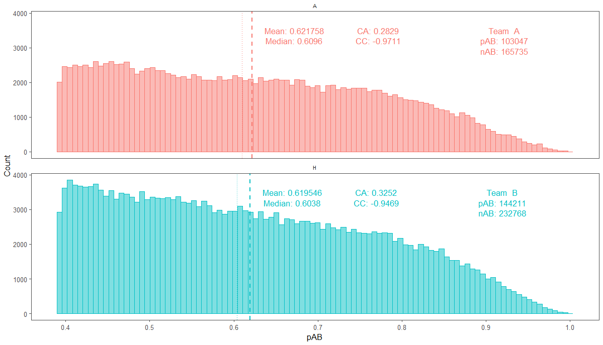{fig-align="center" width="75%"} 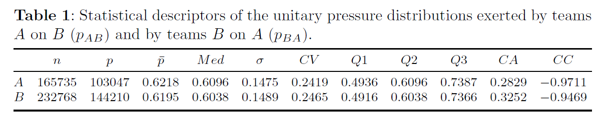{fig-align="center" width="75%"}
:::

## 5.3 Firma Defensiva del Jugador/Resultados {.con-cabecera}

::::: columns
::: {.column width="50%"}
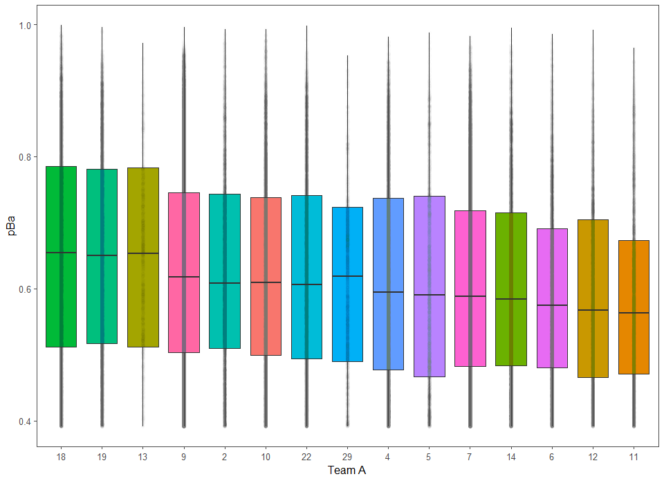{fig-align="center" width="100%"}
:::

::: {.column width="50%"}
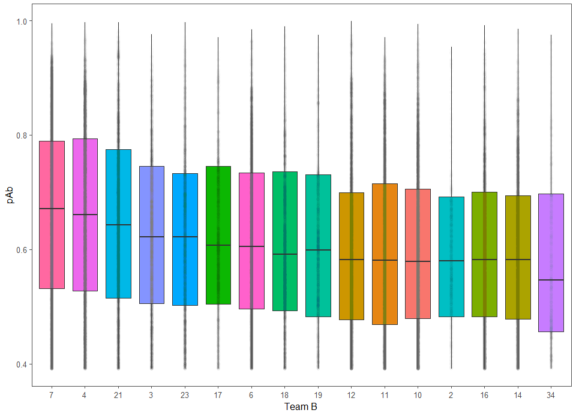{fig-align="center" width="100%"}
:::
:::::

::: notes
Box{Whisker diagrams of player-level unitary pressure distributions for teams A and B, ordered by mean pressure value.
:::

## 5.3 Firma Defensiva del Jugador/Resultados {.con-cabecera}

::::: columns
::: {.column width="50%"}
Ordenadas por el **CA**

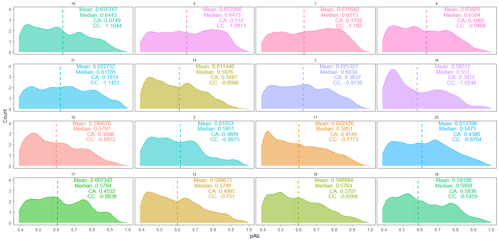{fig-align="center" width="100%"}
:::

::: {.column width="50%"}
Ordenadas por el **CC**

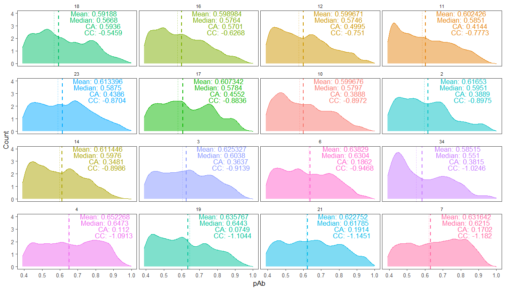{fig-align="center" width="100%"}
:::
:::::

::: notes
Estimated density functions f(pbA) for team B players, ordered by increasing skewness coeficient (CA). Estimated density functions f(pbA) for team B players, ordered by decreasing kurtosis coeficient (CC).
:::

## 5.3 Firma Defensiva del Jugador/Resultados {.con-cabecera}

::: img-slide
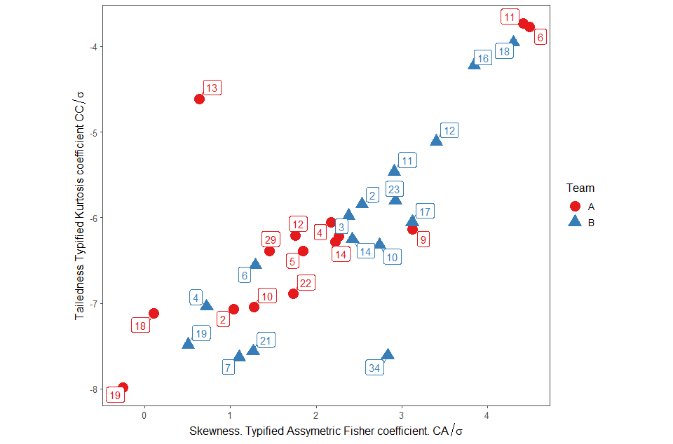{fig-align="center" width="100%"}
:::

::: notes
Scatter plot of the standardised shape parameters for skewness (CA) and kurtosis (CC), used to identify atypical observations and examine player distribution within the feature space.
:::

## 5.3 Firma Defensiva del Jugador/Resultados {.con-cabecera}

::: img-slide
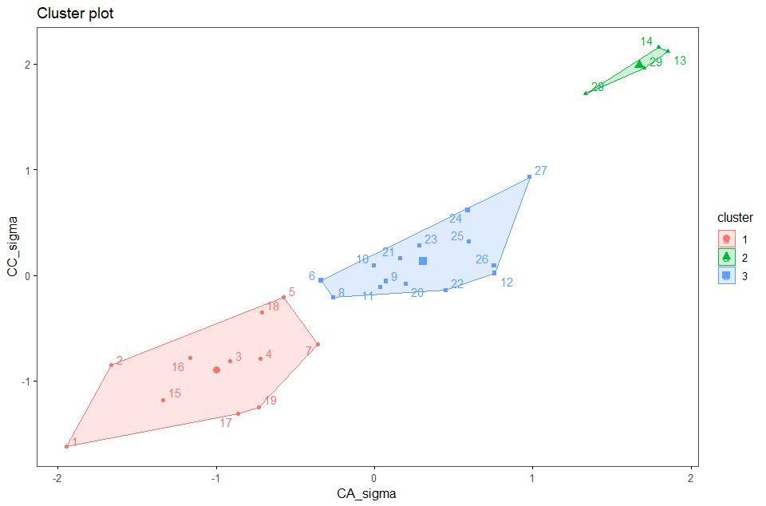{fig-align="center" width="100%"}
:::

::: notes
(b) Elbow analysis applied to K-means clustering, showing the within-cluster sum of squares as a function of the number of clusters; the in ection point at K = 3 supports the selected configuration.
:::

## 5.3 Firma Defensiva del Jugador/Resultados {.con-cabecera}

::: img-slide
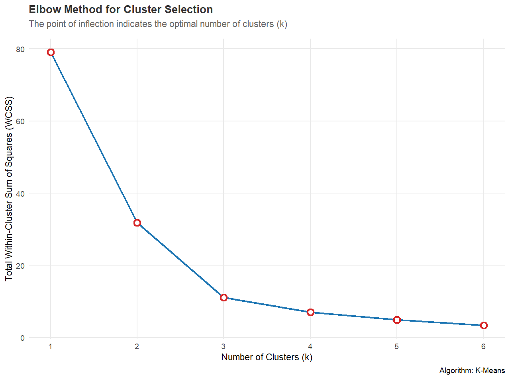{fig-align="center" width="100%"}
:::

::: notes
(c) K-means clustering results for outlield players based on the standardised shape descriptors, illustrating the resulting defensive pressure profiles.
:::

## 5.3 Firma Defensiva del Jugador/Resultados {.con-cabecera}

::::: columns
::: {.column width="50%"}
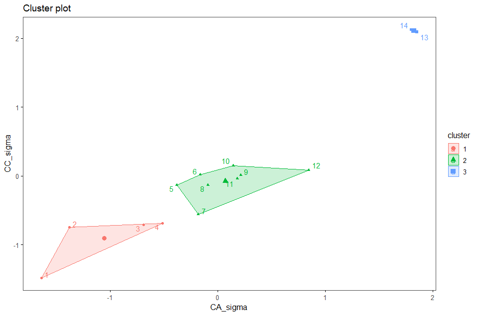{fig-align="center" width="100%"}
:::

::: {.column width="50%"}
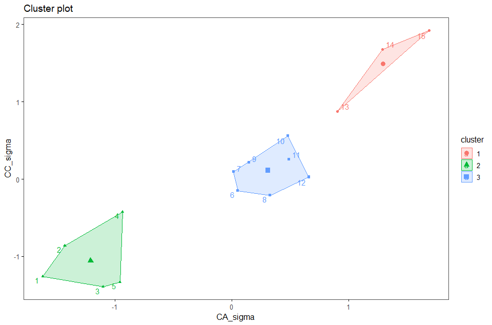{fig-align="center" width="100%"}
:::
:::::

::: notes
Team-specific K-means clustering results for outfield players.
:::

## 5.3 Firma Defensiva del Jugador/Resultados {.con-cabecera}

::: img-slide
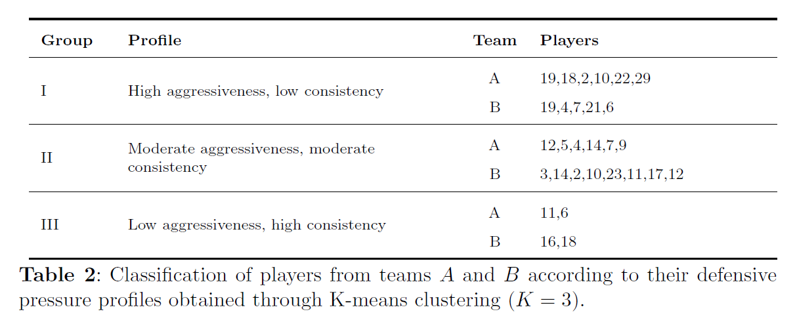{fig-align="center" width="100%"}
:::

::: notes
-   El Grupo I agrupó a jugadores con un comportamiento defensivo caracterizado por una presión más agresiva, aunque menos consistente. - El Grupo II correspondió a perfiles intermedios, con niveles moderados de agresividad y consistencia.
-   El Grupo III reunió a jugadores con una menor agresividad y una mayor consistencia, según los descriptores propuestos.
:::

# 6 Discusión y conclusiones. {.con-cabecera}

::: roadmap
-   1 · Introducción
-   2 · Uso de Redes Neuronales y Análisis Clúster Jerárquico en el Estudio de los Saques de Puerta en el Fútbol.
-   3 · Modelo Matemático para el Estudio de Métricas Defensivas en el Fútbol: Presiones Individuales, Colectivas y del partido.
-   4 · Marco Dinámico para la Evaluación de la Presión Defensiva en el Fútbol.
-   5 · Firma Defensiva del Jugador: Caracterización de la Agresividad y la Consistencia en la Presión Defensiva.
-   [⚽ 6 . Discusión y conclusiones.]{.active}
:::

## 6 Discusión y conclusiones/Objetivos. {.con-cabecera}

::: box-football
**1. Diseñar e implementar un marco propio de análisis de datos futbolísticos**, basado en herramientas abiertas y scripts desarrollados específicamente para la tesis.
:::

::: box-football
**2. Desarrollar métricas matemáticamente interpretables de comportamiento defensivo**, aplicables desde la acción individual hasta la organización colectiva del equipo.
:::

::: box-football
**3. Analizar la defensa como un proceso espacio-temporal dinámico**, especialmente en situaciones tácticas de pérdida de balón y transición defensa-ataque.
:::

::: box-football
**4. Evaluar la robustez, generalización y viabilidad práctica del modelo**, incluyendo su posible uso en contextos reales, cuasi tiempo real, scouting y apoyo a la toma de decisiones.
:::

::: notes
En conjunto, estas conclusiones demuestran que los objetivos definidos al inicio de la tesis han sido alcanzados satisfactoriamente mediante un diseño de investigación coherente y progresivo. Combinando rigor matemático, interpretabilidad y eficiencia computacional, esta tesis contribuye al desarrollo de un marco unificado para el análisis cuantitativo del comportamiento defensivo en el fútbol, reduciendo la distancia existente entre la modelización teórica y el análisis aplicado del rendimiento.

Un aspecto especialmente relevante es que las métricas propuestas son intrínsecamente escalables, lo que permite realizar comparaciones consistentes no solo a nivel de jugadores individuales y partidos, sino también entre equipos, temporadas completas y distintos contextos competitivos. Esta escalabilidad posibilita la comparación objetiva entre equipos de una misma competición, como LaLiga, así como entre diferentes ligas europeas y competiciones internacionales, proporcionando una base sólida para el benchmarking y la evaluación comparativa del rendimiento en distintos entornos competitivos.

Finalmente, las metodologías y resultados presentados abren diversas líneas de investigación futura, entre las que destacan la integración de modelos ofensivos y defensivos dentro de un marco analítico común, la extensión de los enfoques propuestos a otros deportes colectivos y la incorporación de estas métricas en sistemas de análisis en tiempo real y en entornos de retransmisión deportiva. En este sentido, la tesis no solo contribuye al avance del conocimiento científico sobre el comportamiento defensivo en el fútbol, sino que también proporciona herramientas de aplicación práctica con potencial impacto en el ámbito del fútbol profesional, el scouting, el análisis del rendimiento y el apoyo a la toma de decisiones.
:::

## 6 Discusión y conclusiones/Situación actual y futura. {.con-cabecera}

[Mundial 2026 - FIFA](https://www.fifa.com/es/tournaments/mens/worldcup/canadamexicousa2026){target="_blank"}

::: img-slide
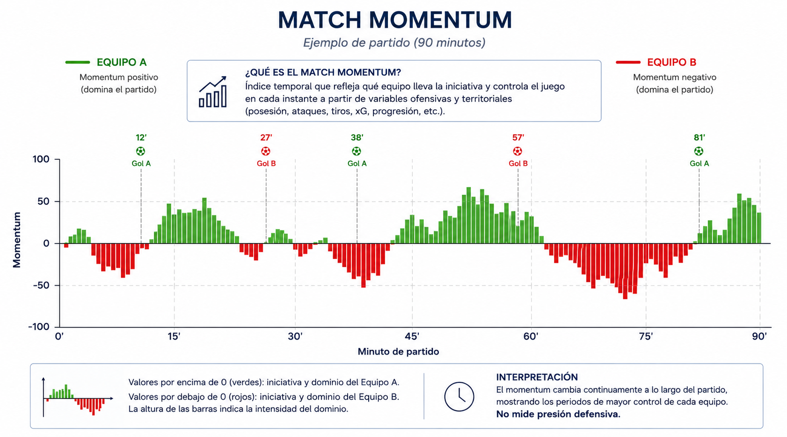{fig-align="center" width="95%"}

:::

# Agradecimientos. {.con-cabecera}
